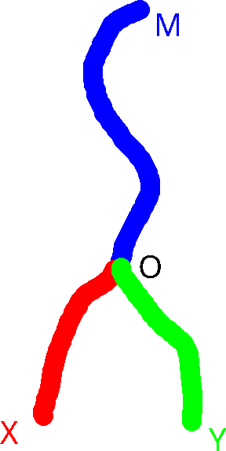
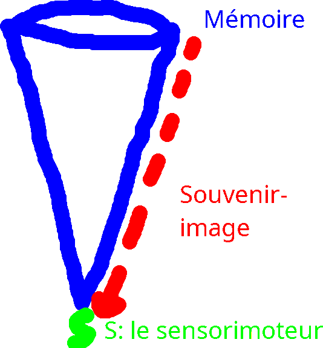
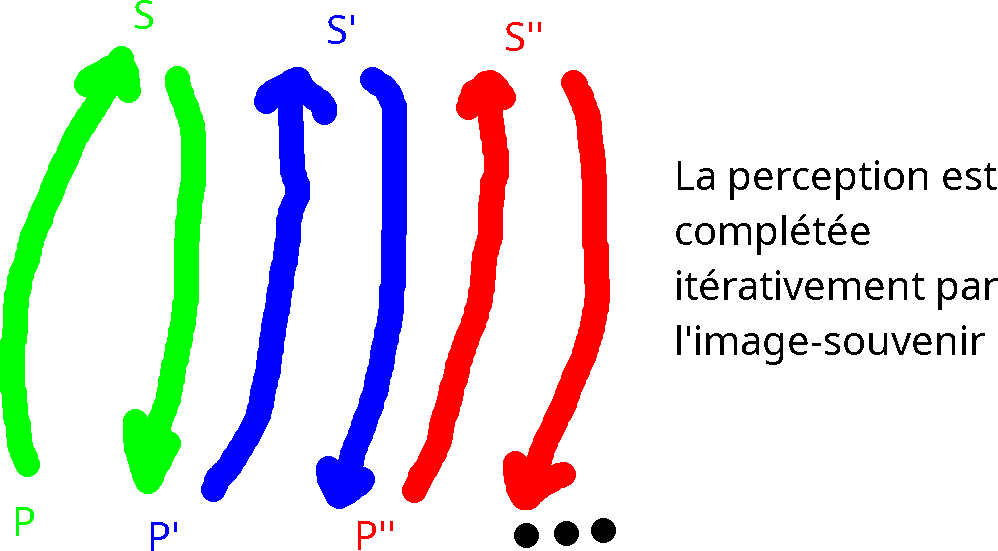
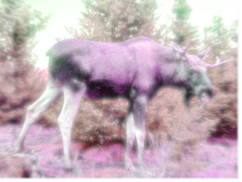

# Fiche de notes: Cours sur Henri Bergson

Les oeuvres principales d'Henri Bergson:

<a href="https://fr.wikisource.org/wiki/Essai_sur_les_donn%C3%A9es_imm%C3%A9diates_de_la_conscience">*Essai sur les données immédiates de la conscience*</a>, 1889 (première thèse de doctorat)

*Matière et mémoire*, 1895 (seconde thèse)

1903: un article d'introduction à la métaphysique

*L'évolution créatrice*, 1907

1911: une conférence sur l'intuition

*Les deux sources de la morale et de la religion*, 1932

Les oeuvres d'Henri Bergson portent chacune sur une question propre. Elle connaissent un retentissement mondial. Henri Bergson s'engage en faveur de la paix au niveau politique, jusqu'aux États-Unis (commission). La première guerre mondiale a tourné Bergson vers la morale, bien que le sujet de sa première thèse soit déjà moral, puisqu'il concerne à la fois des problèmes de métaphysique (l'espace, le temps, le mouvement) et la question de la liberté et du libre-arbitre (sur fond de pragmatisme).

## Essai sur les données immédiates de la conscience (1889)

Structure:

Chapitre 1: de l'intensité des états psychologiques. (1 - 55)

Chapitre 2: de la multiplicité des états de conscience, l'idée de durée (56 - 104)

Chapitre 3: de l'organisation des états de conscience, la liberté (105 - 166)

Conclusion (167-184)

Des quatres paradoxes de <a href="https://fr.wikipedia.org/wiki/Z%C3%A9non_d%27%C3%89l%C3%A9e">Zénon d'Élée</a>: ceux-ci mettent en valeur la différence qu'il y a entre la trajectoire géométrique du mouvement et l'effectuation du mouvement par le mobile. D'après le second paradoxe, celui d'Achille de la tortue, la tortue étant plus lente qu'Achille, mais Achille ne faisant que suivre la tortue, Achille serait incapable de jamais dépasser la tortue. Leurs vitesses propres ne sont bien sûres pas égales. Zénon pense que la divisibilité indéfinie de la trajectoire géométrique empêcherait théoriquement Achille de jamais rejoindre la tortue alors qu'elle avance.

D'après <a href="https://fr.wikipedia.org/wiki/Fran%C3%A7ois_Evellin">Évellin</a>, un élève de <a href="https://fr.wikipedia.org/wiki/Charles_Renouvier">Charles Renouvier</a>, l'illusion du second paradoxe de Zénon provient de l'incompréhension authentique du mouvement comme expérience subjective continue, du fait que le sens commun et le langage sont trop spatialisés. Il faut revenir au réel du mouvement qui *dure*. **Caractérisation de la durée**: le sujet passif, dans la succession de ses états de conscience, est soumis à un flux structuré ou structurant; ces états se succèdent sans césure, ils ne peuvent être disjoints: ils sont contrepénétrés; la conscience est créatrice (présent => passé) mais continue: fusionne du neuf; les états de conscience sont hétérogènes; la durée se conserve (c'est pour cela qu'on peut apercevoir du neuf), ce qui permet de concevoir le progrès au sens historique (il n'y a pas d'évolution sans durée, sans conservation du passé). La durée est une expérience intérieure: **un flux d'états de conscience qui se contrepénètrent, se succèdent, sont continus, hétérogènes et se conservent**. Kant pense le nombre (d'après ses catégories) comme une totalité qui comprend une pluralité d'unités, dans un ordre de succession. Mais pour Charles Renouvier, la juxtaposition est une opération spatiale et non successive. Bergson reprend cette critique de Kant par Renouvier. La numération s'opère par des symboles homogènes juxtaposés, le propre de l'espace est d'offrir la possibilité de l'homogénéisation. Or la durée est toute hétérogène, sans répétition ni identités: on ne pourrait y juxtaposer des unités. Il n'y a pas de première fois et de seconde fois. La durée n'a pas de partie car elle n'est pas une totalité: il faut voir là une opposition du "tout fait" et du "se faisant". La difficulté étant d'arrêter de penser en totalités pour retourner au se faisant. Il serait ici possible de transposer l'argument vers une critique de la société industrialiste et marchande, une critique de mode de production capitaliste: le tout fait est la norme de l'objet, le fini est même la norme du concept, il ne faut dans le monde que de l'accompli (car l'inaccompli ne se vend pas), c'est même la norme de l'artisanat. Une vie d'objets *se faisant*, une production sans reproduction du même (toujours unique) paraîtrait bigarrée, or c'est précisément une erreur à laquelle Bergson appelle à faire attention dans le sens commun par son concept de durée (bien que la critique sociale ne soit pas présente dans son texte, on peut l'émettre en étendant sa pensée au-delà de la question métaphysique ou épistémologique).

Bergson contredit le parallélisme kantien des cadres de l'esprit entre le temps et l'espace, d'autant plus que la durée n'est pas même un cadre. La symbolisation du réel est pratique et valorisable en ce sens pragmatique, mais philosopher c'est justement abandonner le pragmatisme pour retrouver la durée pure: c'est reprendre à zéro le tout fait. 

**La durée est autodifférenciation et autosynthèse**: il n'y a pas besoin de symbole extérieur pour différencier et synthétiser. La durée se laisse proprement atteindre en délaissant le moi superficiel (pragmatique) pour le moi profond. Cet accès peut être passif et actif: au sens où j'entrevois l'avenir de ma durée tout en vivant docilement. Mais au mieux la durée ne peut être décrite (le langage étant spatialisé), elle ne peut qu'être vécue (faut-il voir là un nécessaire silence du philosophe: doit-il de temps à autres abandonner les mots ?)

L'espace n'est pas la forme de l'extériorité (comme chez Kant) mais une conception où des objets possèdent une position relative l'un à l'autre et où par propriété d'homogénéité, la division, la décomposition et la récomposition sont possibles. Chez Kant: le temps est la forme du sens interne et l'espace est la forme du sens externe (mais: les conceptions de l'espace et du temps de Kant restent mathématisées, peut-être par son influence newtonienne).

Il faut encore distinguer l'espace (homogène indéfini) de l'étendue, qui fait référence aux qualités (et non à la quantité): **l'étendue c'est le pur qualitatif**.

L'espace critiqué chez Bergson est encore newtonien: c'est le lieu de la juxtaposition, de l'homogénéité et de la simultanéité (relativité galiléenne). Comment s'opposerait la durée à un espace de relativité einsteinienne ? (auquel Bergson n'avait bien sûr pas accès au temps de la rédaction de l'*Essai* ; par exemple, la simultanéité n'y trouverait pas sa place de la même manière; le caractère discret des atomes pourrait aussi changer cette critique de la physique mathématique).

L'espace est le cadre de nos représentations, on peut y trouver l'invariance et la réversabilité: Bergson pense à la physique. Puis **le langage commun est fixe (ce qui est pratique pour agir) mais cela ne correspond pas à l'immédiateté de la conscience: c'est une symbolisation.**

**Le concept avec son extension (nombre d'objets auxquels il s'applique) et sa compréhension (sa définition générale) rate nécessairement le singulier (extension nulle) et la singularité (compréhension nulle)**. Ainsi de la conscience et de l'existence. Il faut un non-concept pour les penser. Puis pour former des mots, l'on décompose un objet en parties, que l'on nomme individuellement et que l'on utilise pour recomposer l'objet: mais alors ce sont déjà des fixations qui sont symbolisées et non l'objet réel (c'est pourquoi par exemple, penser l'âme *et* le corps est une erreur: en les vivant, ils ne sont qu'un, mais on l'a oublié en en voulant en parler: d'ailleurs, cela n'échappe pas à Descartes, qui conçoit clairement (mais pas distinctement du fait de la multiplicité des sens) l'union de l'âme et du corps dans l'expérience quotidienne, c'est-à-dire par les sens, mais qui ne peut pas lui attribuer de place en métaphysique, car ile ne peut la penser adéquatement d'une manière conceptuelle). La synthèse des symboles est un artefact. En reconstituant le réel à partir de repères fixes, le langage ne peut pas transcrire le mouvant. Le symbole premet d'exprimer ce qui ne peut être exprimé immédiatement: lorsqu'on ne peut s'installer dans la chose, on l'analyse (décomposer-recomposer fixement).

La tâche du philosophe est donc d'être subversif en reprenant le langage à zéro pour en extraire les évidences: en le défaisant de sa spatialisation, de sa généralité, de son homogénéité.

### Chapitre 1: (réordonner les titres pour avoir 1,2,3)

Analyse de la sensation: grandeur, intensité, quantité, qualité. Les sensations sont généralement considérées comme des grandeurs intensives, pouvant croître et décroître, du fait de Kant (car l'espace est la forme de la sensibilité extérieure). Mais ce sont des qualités, ce que l'on décrit comme étant une sensation de différentes grandeurs. Par exemple la tristesse (sensation sans cause extérieure: ni une affection ni une représentation) est un ensemble contrepénétré d'états d'âme et chacun de ces états est unique (états d'âme: sensations et idées), de même, l'effort, ou rougir (émotion), ne sont pas différents en esprit de leur manifestation physique: il n'y a pas d'espace de sensation précédant la prise de conscience ou inversement; c'est **une seule qualité, irréductible à une quantité**. 

Pour un changement qualitatif, **en projetant la cause dans l'effet, je crée une grandeur intensive (spatialisation)**. La sensation affective est authentiquement une qualité. La douleur est informative et la sensation est même un commencement de liberté: elle permet de prendre des décisions. Idem pour les sensation représentatives (indiquent un objet): il n'y a qu'une variation qualitative (ex: changement d'éclairage) et non intensive. On met la cause (l'éclairage variant) dans la sensation et c'est la source de l'erreur. La répétition de l'expérience (l'habitude) nous pousse à projeter la cause dans l'effet. Il faut, selon le mouvement philosophique de Bergson, retrouver l'immédiateté sous les concepts d'entendement.

Cette **critique d'un schématisme de transition illégitime de la qualité à la quantité**, de la durée à l'espace, est appliquée à l'intensité (chapitre 1), au mouvement (chapitre 2) et à l'action (antécédent/conséquent, chapitre 3).

La critique des théories psychophysiques: la loi de Weber est une expression de la différence minimale entre deux excitations qui est requise pour produire une différence de sensation perceptible (cette expression ne concerne pas les causes de la sensation, mais l'effet de le sensation, donc Bergson ne s'y oppose pas). En revanche Bergson s'oppose à la loi de Fechner-Weber: la sensation serait proportionnelle au logarithme de l'excitation, et alors: 1) la sensation pourrait croître en quantité, 2) elle naîtrait en parts égales, 3) les petites différences sont infinitésimales ce qui permet l'intégration mathématique (inverse de la dérivation). Cette loi, utilisée pour le calcul des décibels, est méthodologiquement critiquable: c'est pour Bergson un artifice fallacieux qui pervertit l'authenticité qualitative des sensations.

Le problème de la liberté: la liberté est une manière d'agir où l'action dépasse sa propre cause (la nécessité étant prévisible en droit si les causes sont connues). La prévision est d'ordre spatial: la vie intérieure est durable, sans répétition: singulière. Les qualités ruinent la possibilité d'une mesure de l'antécédent à la conséquence dans la vie intérieure.

Il fallait montrer le tort de la psychophysique (déterminer et mesurer un état de conscience par la mesure d'une sensation, la cause par l'effet) pour libérer l'esprit du joug d'un temps et d'un espace mathématisés, homogènes et fixes. Il y a un parallèle du déterminisme physique (tout mouvement est nécessairement la résultante d'un mouvement) et du déterminisme psychique (la volonté n'est que le jeu des motifs qui la dirigent; selon Mills, le motif le plus fort apporte le plus de plaisir, la volonté étant strictement déterminée par son hédonisme): Bergson détruit ce parallèle.

Mills a une base associationniste à sa philosophie (l'esprit serait un agrégat d'éléments simples et décomposés: idées, sensations, émotions) que Bergson critique: c'est un "moi impersonnel" qui est créé en dédoublement de la durée individisible dans un espace statique; d'autre part les motifs ne sont pas comparables quantitativement mais seulement qualitativement (la durée n'étant pas homogène, les motifs d'agir ne le sont pas non plus). Le schème causal du déterminisme physique ne peut pas s'appliquer à l'ordre psychique car le temps, la succession, est hétérogène. De ce fait la liberté du sujet est authentique car elle est imprévisible: elle ne dépend que de sa personnalité, c'est-à-dire de l'histoire singulière de sa durée, qui le mène à opérer ses choix. Du fait de cette singularité, les voies de choix ne peuvent jamais êtres prédites, ni les choix entre les voies. **L'avenir est produit, il se distingue du possible: la virtualité produit sa propre temporalité**.

Le moi est scindé en un puis sans pour autant être ontologiquement divisé: <a href="https://fr.wikipedia.org/wiki/Pierre_Janet">Pierre Janet</a>, l'*Automatisme psychologique*, analyse de l'hypnose, des actes effectuées durant l'hypnose dont on ne conserve pas la mémoire: il y a un moi des mécanismes automatiques (superficiel) et un moi profond. L'acte libre est un acte singulier d'expression personnelle et d'imprévisibilité authentique. L'action mécanique résulte du passé, alors que l'acte libre ouvre sur l'avenir. L'acte libre trouve son exemple parfait dans l'action artistique qui fait passer le sujet par des états de conscience singuliers et envisagés pour eux-mêmes. Bergson rejoint son maître Boutroux: le temps est une durée, elle est créatrice; l'individu est auteur de sa liberté (autodétermination); le réel est qualitatif, singulier: il est spirituel, l'abstraction et le général sortent du réel.

La personnalité: c'est une énergie emmagazinée qui, contractée, permet de se projeter en avant et c'est une certaine orientation, du fait de la singularité de la durée. **La personne se reconnaît à l'acte libre** (donc le mécanisme est impersonnel).

La critique du choix, modèle de décision:

M ===> O X ou Y

**Entre MOX et MOY il n'y a pas le choix rationnel de deux possibilités égales, mais une réinvention constante du moi qui mobilise son passé pour agir dans la durée et devenir la personnalité qu'il crée**. Le choix est irréductible à la logique et à la mesure (mesure du pour ou du contre du plaisir/déplaisir de chacun des choix et de ses conséquences). Penser la dichotomie du choix c'est refaire l'histoire en se plaçant au point d'arrivée, après l'action: c'est penser en termes de possible et non en être en acte. Jankélévitch: l'illusion des futurs antérieurs. Nous faisons comme si la justification *a posteriori*, que l'on anticipe, devrait avoir une valeur pour l'action: mais je ne peux pas ne pas être moi. **Je ne subis pas mon passé, je le motive: je deviens toujours mon passé neuf**.

## Matière et mémoire

C'est l'un des ouvrages les plus durs de Bergson. Il dépasse le dualisme de l'espace et de la durée, il réfléchit à l'âme et au corps. Il propose une théorie du sujet avec au centre la question de la consistance du moi.

Bergson commence par proposer la fiction philosophique de l'image-monde: une perception désubjectivée du moi, sans corps, sans mémoire. Il montre que la perception n'est pas une connaissance: les objets sont le tout de la perception. La pure perception, le monde-image, c'est le moi sans mémoire, dans le pure présent (qui n'existe pas de fait, mais qui est imaginé en droit: c'est une expérience de pensée). Bergson s'oppose aux idéalistes (selon lesquels les choses sont les représentations d'une conscience incarnée, mais la chose-en-soi ne serait pas connaissance: Kant) et aux réalistes (le monde existerait indépendamment du sujet: positivistes, science): le problème de l'adéquation objet-en-soi / objet-pour-moi est un faux problème.

La perception est extérieure à toute subjectivité (exemple: l'amibe) et le corps fait effet de conducteur, de matrice de répartition des mouvements de la matière. La perception mesure notre action possible sur les choses et l'action possibles des choses sur nous: elle passe par le sens, elle est nécessairement utile. La perception incarnée crée un point de vue qui s'arrête à la partie du réel qui intéresse le corps. La perception rate une partie du réel car il n'est pas dans sa fonction de tout retenir.

La perception est le plus souvent accompagnée d'un acte de conscience et elle est mariée à la mémoire: retarder la réaction crée un moment d'indétermination qui permet de considérer des possibilités, ce qui est un avantage pragmatique. Il y a cette différence de nature: la sensation, c'est l'action réelle; la perception, c'est l'action possible.

À l'opposée de la perception pure: le souvenir pur; au milieu, le souvenir-image et la perception concrète (souvenir: la représentation d'un objet absent). **Le passé se conserve intégralement, mais il est inconscient, virtuel comme la perception pure.** L'oubli: l'intégralité du passé n'est pas utile pour agir (Bergson doit expliquer la raison de l'existence de l'oubli, s'il pose que l'existence et la fonction de la mémoire sont essentielles voire évidentes).

L'élasticité du présent donne à la conscience le rôle de mobiliser les souvenirs du passés dans l'action (perception) ou en tant qu'image consciente.

Tout ce processus se passe dans la durée. En s'approfondissant, la durée devient inactuelle. Sans l'attention au présent, nous vivons dans le rêve: notre vie psychique se reflète.

Le souvenir ne me donne une impression de passé qu'en-dehors de la perception.

Du fait de la durée, nous ne percevons (différent de sentons) pratiqueemnt que le passé. La sensation est matérielle, mais le souvenir est immatériel. Comme un cône: 

la durée se contracte pour agir dans le présent. Elle y est engagée; je la suis. Le point S (sensorimoteur) est le point de contact du matériel et de l'immatériel.

Il ya deux mémoires: la mémoire habitude et la mémoire pure. La mémoire habitude joue des mécanismes évoqués par une certaine attitude du corps, elle se trouve dans le corps. C'est une réaction standardisée.

Reconnaître un objet, c'est savoir s'en servir (exemple de l'agnosie: mémoire intacte, mais difficulté à reconnaître). Il y a une connexion entre la perception et la motricité qui mobilise deux mémoires. L'attention: c'est la perception qui se recomplète par l'image-souvenir. Elle engrossit l'objet.

Le schéma-moteur:  la tendance motrice servant à esquisser les contours d'un objet pour permettre la reconnaissance. Toute compréhension passe par ces schèmes. Le schème est une mise en mouvement des images, par assemblage d'éléments passés.

Il y a plusieurs plans de conscience (perception, souvenir, hypothèse) et le schème circule entre eux pour dynamiquement construire l'objet de mon présent.

Autres théories de la mémoire: Maurice Halbwachs (repères sociaux, évènements marquants: des raisons sociologiques à la mémoire). Pierre Janet: la mémoire comme conduit du récit.

Par l'indice du schème, le tout précède les parties (il appelle l'attention pour compléter l'objet).

Le comique (Bergson, *Le Rire*, 1900) c'est confondre le plan de conscience sensorimoteur et celui du rêve: c'est agir mécaniquement au lieu d'être vivant plus profondément.

Une difficutlé que Bergson ne résout pas: si la totalité de la mémoire est comme une bande magnétique de tout ce qui est passé sous la point du pôle sensorimoteur (ex: vision panoramique des mourants), mais qu'en droit, ma vision est infinie, alors qu'en fait elle est limitée à la zone intéressée de l'action: la mémoire conserve-t-elle une perception infinie ou seulement une perception refoulée ? A partir de la théorie bergsonienne, l'on sait que tout est senti: mais par le schème, la perception opère un choix sur ce à quoi l'on doit donner attention. Qu'est-ce qui est mémorisé dans le passage du senti au perçu ?

Puis Marx/Engels: la liberté est acquise par aliénation de l'individu par rapport à l'espèce. On pourrait trouver une compatibilité entre l'approfondissement de la durée et l'individualisation au sens de Marx/Engels; Bergson développant également une théorie de l'individualisation par rapport à l'espèce dans *L'évolution créatrice*.

"L'âme et le corps" in *L'Énergie spirituelle* (Bergson) est un bon résumé des thèses de *Matière et mémoire*.

**Les idées générales ne proviennent pas d'une volonté intellectuelle d'abstraire des caractéristiques réelles afin de les reconnaître dans une multitude d'objets: mais des exigences de l'action qui standardisent la réaction aux stimulis.** L'action s'opère dans l'espace (répétition) et l'individualité se trouve dans la durée (ce qui rejoint l'*Essai*).

Le système nerveux du corps réagit à la matière (moelle, nerfs) mais en faisant un détour par le cerveau, ouvre un degré de contingence qui permet la liberté. Ici Bergson matérialise la durée ouverte par l'*Essai* dans le corps (on n'a plus l'impression d'un spiritualisme abstrait, d'une durée sans support réel). Le cerveau est un instrument pratique qui ne dédouble pas les objets (contrairement aux dualismes des idéalistes et des réalistes): il ne crée pas de représentations au sens dualiste, pas de correspondance symboliques. Il y a un rapport entre la complexité du cerveau et le degré d'indépendance de l'organisme (*L'évolution créatrice*, ch. 2, p. 263). L'esprit s'insère dans la matière par l'entremise du cerveau.

Le corps est l'espace de la limite avec les autres corps. L'image c'est l'au-dehors: Bergson contredit Spinoza (épiphénoménalisme de la conscience spirituelle et matérielle: *duplicati* harmonieux) et Hippolyte Taine: la perception n'est pas intellectualiste, pas désintéressée, pas une "hallucination vraie", il n'y a pas de dédoublement, pas d'intériorisation. Bergson contredit aussi les associationnistes (ressemblance, continuité, contraste), la perception n'opère pas ainsi.

La ressemblance, la continuité sont nécessaires à l'action présente: elles ont une origine schématique. Il y a des associations dirigées, aux éléments hétérogènes, à travers plusieurs plans de conscience: ce que ne distinguent pas les associationistes (associations spontanées).

La mémoire: Bergson s'oppose à la thèse du pli (Descartes, Harthey, Maudsley, Delboeuf) selon laquelle la mémoire est la réactivation d'une première trace à la perception d'une trace ressemblante (car il n'y a pas de même dans la durée) et à la thèse des localisations des causes de l'aphasie: c'est dans tous les cas le verbe qui résiste le mieux et c'est toujours le même ordre de disparition peu importe où l'on localiserait la région problématique: car c'est le plus utile à l'action qui demeure.

La matière: c'est une étendue de phénomènes et non pas un espace de répétition. La qualité c'est la condensation des oscillations atomiques de la matière. La matière, par la phase, se présente elle-même dans la durée: elle est movuement d'abord, espace en dernier par une opération toute humaine. La matière est plus diluée (séparée, discrète) que nos sensations. La durée du rêve est aussi plus diluée (il y a plus d'événements, ce pour quoi le temps passe différemment) que la durée de l'éveil. La matière est comme un esprit si dilué qu'il n'a pas de nécessité, pas de mémoire: c'est la limite du pur présent. Cette image métaphysique renforce la cohérence de l'explication bergsonienne de la vie de l'esprit.

**La matière est informe telle quelle, mais la nécessité d'agir l'informe: une différence spatiale entre le corps et le monde est créée, ainsi que la substance et les accidents; l'objectivité spatiale est plus artificielle que l'étendue qualitative.** La spatialité n'est pas l'attribut de la science: la science va au fond des événements. C'est l'attribut du langage, donc aussi du philosophe, du métaphysicien ? En tout cas s'il ne travaille pas sur l'expérience (*Essai*: Bergson cherche la durée *sous* le langage, ce qu'on pourrait appeler une métaphysique supraphilosophique, ou authentique car elle va au-delà de la naturalité des mots (au-delà de toute habitude)). La vraie substance, c'est la durée, qui est changement.

**La mémoire fait l'individualité et la liberté du sujet. Notre caractère est la synthèse de tous nos états passés. Le passé étant inconscient, il est confus dans la présent (condensé) bien que la totalité de notre passé conditionne notre actualité. Justement la projection du passé est le lieu de la liberté: c'est *créer* notre durée, par la mémoire du vécu et du corps dans le sensorimoteur (schèmes).**

**Entre le pas encore et le déjà plus, ma conscience est opérante**. Le présent du "se faisant" gros de l'avenir. Il relie mémoire pure et mémoire habitude. Sans l'attention, je m'aperçois comme une histoire continue.

Le réalisme de la perception et l'idéalisme de la mémoire dépassent les dichotomies usuelles des philosophies de l'esprit.

L'on peut donner deux lectures de *Matière et mémoire*: spiritualiste et biologiste. Bergson s'est basé sur des travaux savants et il eut un retentissement en neurologie (science qui débutait à son époque).

Sa théorie de la perception est en partie confirmée: par exemple, par les neurones miroirs (mouvement pré-moteur et théorie de l'esprit); l'idéo-moteur; le cerveau fonctionne en étant l'interface du corps et du social (neurosciences, Auguste Comte); les fonctions cérébrales, puisque l'imagerie montre que l'hémisphère gauche est davantage lié à un traitement du symbole et le droit au spatial, à la décision et à l'action, ce qui ne contredit pas Bergson qui ne s'opposait qu'à la localisation des fonctions langagières du fait que plusieurs anomalies que l'on situait différemment prenaient le même ordre de dégradation; la plasticité du cerveau: la thèse des traces cérébrales tend à être confirmée par la science (le pli) contredisant là Bergson; la mémoire déclarative (mémoire sémantique: connaissance partagées dans une culture + la mémoire épisodique: épisodes de contextes qui peuvent se répéter) et la mémoire procédurale (habitudes du corps); la mémoire de long terme et la mémoire transitoire (qui mobilise des souvenirs dans le présent et où se trouvent des informations à stocker): rappel et reconnaissance...

"L'âme et le corps", texte présenté à la conférence *Foi et vie*.

## *L'évolution créatrice*

Structure:
Chapitre 1: de l'évolution de la vie, mécanisme et finalité (1 - 98)

Chapitre 2: les directions divergentes de l'évolution de la vie, torpeur, intelligence, instinct (99 - 186)

Chapitre 3: de la signification de la vie, l'ordre de la nature et la forme de l'intelligence (187 - 271)

Chapitre 4: le mécanisme cinématographique de la pensée et l'illusion mécanistique, coup d'oeil sur l'histoire des systèmes, le devenir réel et le faux évolutionnisme (272 - 372)

Dans le paysage philosophique et scientifique se posait la question de la fin dans les sciences biologiques: pour Kant, la fin n'existe pas dans la nature, mais elle a un intérêt spéculatif en tant qu'horizon, c'est une idée régulatrice: une idée heuristique. Mais il n'y a pas exactement de fin réelle dans la nature ([jugement déterminant opposé à un jugement réflechissant](https://fr.wikipedia.org/wiki/Jugement_d%C3%A9terminant_et_jugement_r%C3%A9fl%C3%A9chissant)).

Bergson critique: le finalisme (fin intérieure) et le mécanisme (fin extérieure) sont les deux faces d'une même pensée causale et fabricatrice: elle correspond à notre faculté de connaissance (qui découpe et réalise des idées planifiées par avance) mais ne restitue pas la créativité du changement, de la durée. L'organisation est l'arrêt visible et palpable d'un mouvement invisible et impalpable (le mouvement de l'élan de vie).

Bergson critique les darwinistes (formation accidentelle) et les lamarckiens (renforcement héréditaire des fonctions les plus exercées) en les regroupant sous l'ordre général des analystes: ils perçoivent le mouvement de l'évolution comme une série d'instantanés et partent de la conclusion de cette série pour retrouver sa cohérence dans les faits passés. Mais l'élan vital, qui fait unité, est originel et il ne produit que du désordre et de la dissociation: non pas une convergence. C'est une poussée: une vis à ergot qui s'oppose à une idée finaliste de la cause de l'organisation de l'organisme.

*Rare photographie de l'élan vital, en train de vitaliser à fond.*

Une homologie de la structure du vivant: la sensibilité. par analogie, c'est comme une nature psychologique qui rejoins la conscience: envelopper une multiplicité de choses qui s'entrepénètrent. La vie est du se faisant, avec du virtuel actualisé par divergence. La vie charrie une chose similaire à une volonté sans fin (sans but), sans anticipation: "La vie est en réalité d'ordre psychologique, et il est de l'essence du psychique d'envelopper une pluralité confuse de termes qui s'entrepénètrent. Dans l'espace, et dans l'espace seul, sans aucun doute, est possible la multiplicité distincte: un point est absolument extérieur à un autre point. Mais l'unité pure et vide ne se rencontre, elle aussi, que dans l'espace: c'est celle d'un point mathématique. Unité et multiplicité abstraites sont, comme on voudra, des déterminaitons de l'espace ou des catégories de l'entendement, sptailité et intellectualité étant calquées l'une sur l'autre. Mais ce qui est de nature psychologique ne saurait s'appliquer exactement sur l'espace, ni entrer tout à fait dans les cadres  de l'entendement. Ma personne, à un moment donné, est-elle une ou multiple ? Si je la déclare une, des voix intérieures surgissent et protestent, celles des sensations, sentiments, représentations entre lesquels mon individualité se partage. Mais si je la fais distinctmeent multiple, ma conscience s'insurge tout aussi fort; elle affirme que mes sensations, mes sentiments, mes pensées sont des abstractions que j'opère moi-même, et que chacun de mes états implique tous les autres. je suis donc - il faut bien adopter le langage de l'entendement, puisque seul l'entendement a un langage - unité multiple et multiplicité une; mais unité et multiplicité ne sont que des vues prises sur ma personnalité par un entendement qui braque sur moi ses catégories: je n'entre ni dans l'une ni dans l'autre ni dans les deux à la fois, quoique les deux, réunies, puissent donner une imitation approximative de cette interpénétration réciproque et de cette continuité que je trouve au fond de moi-même. Si, dans son contact avec la matière, la vie est comparable à une impulsion ou à un élan, envisagée en elle-même elle est une immensité de virtualité, un empiétement mutuel de mille et mille tendances qui ne seront pourtant "mille et mille" qu'une fois extériorisées les unes par rapport aux autres, c'est-à-dire spatialisées. Le contact avec la matière décide de cette dissociation. La matière divise effectivement ce qui n'était que virtuellement multiple, et, en ce sens, l'individuation est en partie l'oeure de la matière, en partie l'effet de ce que la vie porte en elle." (p. 258 - 259). La vie se débat avec la matière: elle l'indétermine en l'organisant; elle est finie donc explosive car divergente; elle diverge car elle a des tendances: des manières adptatives trouvées au cours du se faisant: "Des phénomènes observés dans les formes les plus élémentaires de la vie on ne peut dire s'ils sont encore physiques et chimiques ou s'ils sont déjà vitaux. Il fallait que la vie entrât ainsi dans les habitudes de la matière brute, pour entraîner peu à peu sur une autre voie cette matière magnétisée. Les formes animées qui parurent d'abord furent donc d'une simplicité extrême. C'étaient sans doute de petites masses de protoplasme à peine différencié, comparables du dehors aux Amibes que nous observons aujourd'hui, mais avec, en plus, la formidable poussée intérieure qui devait les hausser jusqu'aux formes supérieures de la vie. Qu'en vertu de cette poussée les premiers organismes aient cherché à grandir le plus possible, cela nous paraît probable: mais la matière organisée a une limite d'expansion bien vite atteinte. Elle se dédouble plutôt que de croître au-delà d'une certain point. [...] Mais les causes vraies et profondes de division étaient celles que la vie portait en elle. Car la vie est tendance, et l'essence d'une tendance est de se développer en forme de gerbe, créant, par le seul fait de sa croissance, des directions divergentes entre lesquelles se partagera son élan. C'est ce que nous observons nous-mêmes dans l'évolution de cette tendance spéciale que nous appelons notre caractère." (p. 100). Note personnelle: l'on peut penser à ce sujet aux tendances chez Paul Janet, qui est un auteur extrêmement majeur dans le domaine de la psychologie, auquel Bergson s'est toujours intéressé. Et du virtuel s'actualisant: très différent du possible ! (voir: "Le possible et le réel" in *La pensée et le mouvant*).

Chapitre 3 et 4: biologie et connaissance:

L'intelligence est l'attention que l'esprit prête à la matière. La matière et l'intelligence se sont données mutuellement par l'élan vital (adaptation réciproque, outils naturels (organes) et artificiels pour retenir quelque chose de fixé, dans la durée de l'action). Kant: l'équation transcendantale: la forme de l'expérience est la même que la forme des objets de l'expérience.

L'intelligence est fabricatrice, elle peut réarranger dans un espace abstrait, *ad infinitum*: mais **parce qu'elle réarrange ce qui était déjà là et car la science est une extension de l'intelligence, elle a du mal à comprendre la vie et la propre origine de l'intelligence**. Le langage étend le champ d'action de l'intelligence, il comprend: il ramène l'autre au même (penser à ce texte de Husserl sur l'autre et la viande TROUVER REF). L'instantané fournit un équivalent pratique du mouvement. L'instinct est différent de l'extérieur: c'est une unité parfaite, où l'intelligence procède par décomposition (donc elle a une histoire de son développement). L'instinct est un couple: et la nature ne procède pas intelligemment mais créativement (penser ici: un argument de philosophie du progrès). L'instinct a un rythme de durée proche de l'immobile. La vie s'autodifférencie. L'intuition est une faculté (et une méthode) qui permet de faire un usage intelligent de la perception pour la retourner contre (vers) elle-même: et saisir le mouvant. Les évolutionnistes pensent aux conditions [gnoséologiques](https://fr.wiktionary.org/wiki/gnos%C3%A9ologie) de leur science avec intelligence, mais manquent d'intuition: il faut explorer davantage cette marge de l'intelligence. 

Chapitre 4: le néant, le désordre, changer de catégorie et faire un vide: ce sont là des faux problèmes de la métaphysique. Il n'y a jamais de rien, seulement de l'être. D'après la théorie bergsonienne de la connaissance, la tendance de l'intelligence à fixer l'enlise dans des paradoxes qui d'un point de vue pragmatique, sont de faux problèmes. Preuve linguistique: il n'y a pas de réalité à une proposition négative, mais seulement à la proposition positive qu'elle nie: a est réel, [¬](https://en.wikipedia.org/wiki/Negation)a est intelligent.

Dans l'histoire des sciences: la précision des mathémathiques vient de la matière; les lois (sciences naturelles) sont plus exactes que les genres (sciences du vivant). Si la science avait débuté par les sciences de l'esprit, elle serait restée floue. Mais il y a une équivocité de la loi et du genre: elles ramènent du différent au même, comprennent des éléments incomaptibles entre eux. La philosophie doit pouvoir dépasser les alternatives scientifiques du relativisme (relations: rapports des faits entre eux) et du dogmatisme (genres). (Bergson ne fait-il pas usage de son intuition dans ce but, en explorant la durée et/ou l'élan vital ?)

La démarche scientifique antique est qualitative, la moderne (16ème siècle) est quantitative. En se modernisant à partir de Descartes (mesure généralisée et géométrie analytique) elle prend un caractère cinématrographique qui manque le mouvement (temps, espace). (Une idée philosophique: Descartes à l'origine du cinéma: découper techniquement le réel par la photographie est un des parachèvements de la volonté de découper intelligemment le réel.)

Chez Platon, la métaphysique a toute l'essence des tendances de l'intelligence: l'être véritable, c'est l'idée immuable; le temps est comme l'image mobile de l'éternité (alors que pragmatiquement: l'éternité est l'image immobile du temps); il y a toute la crudité de la pensée intelligente, résorbée par les idées. Le modernisme n'a pas perdu cette forme de platonisme, elle l'a juste étayée par la quantité. La philosophie doit passer outre: ce pourquoi elle ne prend pas une méthode scientifique ! (Alors qu'on lui reproche souvent son manque de scientificité: or justement la scientificité ne lui serait pas bénéfique).

## *Les Deux sources de la morale et de la religion*, 1932.

Structure:
Chapitre 1: l'obligation morale (1 - 104)

Chapitre 2: la religion statique (105 - 220)

Chapitre 3: la religion dynamique (221 - 282)

Chapitre 4: remarques finales, mécanique et mystique (283 - 338)

L'évolution *créatrice*: c'est provocant pour les théologiens qui s'opposent aux évolutionnistes. En effet le dieu chrétien est conçu comme une supra-conscience ou telle la source de la rivière: distinct mais non externe à l'élan vital. Dieu est le créateur, mais dans ce titre la créativité est l'attribut de l'évolution (inversement, les évolutionniste n'aimeraient pas donner un sens créationniste à l'évolution). Bergson a rédigé quelques lettres et dires entre 1909-1911 sur la religion. Puis il publie son ouvrage en 1932, dans l'entre-deux guerres. L'obligation morale est naturelle; c'est la forme que la nécessité peut avoir pour un être qui est intelligent et libre. Les individus, en tant qu'ils ont un sentiment d'uex-mêmes, tendent à la dispersion; la discipline comble l'écart entre les intérêts individuels et la cohésion sociale. L'obligation n'est pas intelligente en soi: elle est automatique. Elle comble l'être en déficit d'instinct. Place de la solidarité dans l'organisme social:

Minimum: insecte.
Maximum: humain.

La fonction remplace l'action et ouvre une marge indéterminée d'action. La société possède deux sens de clôture: l'isolation par rapport à l'ennemi et la fusion organique intérieure qui fait pression sur les individus. Mais des individus exceptionnels peuvent apparaître dont les idées brisent cette norme de la nature et créent des chemins imprévus. Première source de la morale: le religon; seconde source: les individus exceptionnels qui introduisent de l'imprévisibilité (penser ici à l'évolution créatrice). Par exemple: les Droits de l'Homme et une morale qui transcende la clôture des sociétés. L'imprévisible dans l'histoire propose un modèle de progrès discontinu et qualitatif. Deux tendances opposées: l'élan et la pression de la nature à se fermer, centripète, infra-intellectuel, par pression, ordre impersonnel; le rayonnement, centrifuge, par aspiration ou attraction, émotion et action: supra-intellectuel.

Mill: morale utilitariste où l'individu est en conflit avec la société. Kant: morale idnividuelle. Durkheim: être obligé, c'est reconnaître l'instance supérieure qui dépasse les individus (la société dans son ensemble). La morale est en nous mais c'est une erreur de croire qu'elle est *de* nous. Le fondement de la morale est sociologique. La morale est en tension avec nos désirs immodérés; cependant chaque conscience individuelle exprime de son point de vue la normale sociale (il y a donc des écarts par rapport à la convention).

**L'impératif moral kantien est inconditionné: motivé par soi-même, pour soi-même et en pure raison. Mais l'impératif moral bergsonien se présente de manière naturaliste comme la conscience momentanée d'une obligation. La raison morale est la rationalisation d'une morale qui n'a pas son origine dans la raison.**

L'intelligence justifie l'élan vital mais elle va à l'encontre du devoir. Dans la rationalité du devoir, il y a quelque chose de plus que la raison, sinon nous n'aurions pas de morale rationnelle. 

Les héros moraux et les types d'émotion: celle aux effets de surface (intelligence et imagination) et l'émotion supra-intellectuelle (l'on retrouve ici la divison de *Matière et mémoire* et de la durée des *Donnés immédiates*...), qui précède l'intelligence: c'est une source de création. Elle est incarnée par de rares personnes dont elle rayonne. L'émotion est contagieuse, elle pousse à un sentiment de fraternité humaine (par-delà les sociétés) et mène à des idées: les Droits de l'Homme par exemple.

Il y a deux religions: l'une correspond à une fonction fabulatrice et mythologique: Levy-Bruhl,  qui l'attribue aux sociétés primitives, critque son absence de causalité et de principe de non contradiction (action à distance) mais Bergson explique: la causalité mythologique correspond au même effort de prédiction de l'action imprévisible de la nature pour garder sa vie sauve qui est aussi donné par l'intelligence non primitive, c'est-à-dire que l'interposition d'une conscience surnaturelle et l'application d'une causalité physique ont la même fonction vitale et cela n'est pas idiot ni insensé (au contraire de ce que pense Lévy-Bruhl). D'autant plus, Lévy-Bruhl n'a fait aucune observation pour supporter sa critique.

Alors: cette source est infra-intellectuelle (prend source dans la vie) mais l'expérience mystique de l'exceptionnel rayonnement qui tire l'humanité est supra-intellectuelle: elle prolonge la vie. 

Comte et Mill mettent en avant le rôle des grands esprits pour propulser l'humanité. Gabriel Tarde (dont Bergson a fait l'éloge) fonde les relations sociales sur une imitation entre individus: ce qui pourrait expliquer l'idée de rayonnement.

Dans l'*Évolution créatrice*, Bergson voit la technique comme un moyen de se libérer de la matière. La technologie nous offre du temps. Mais il est bien moins optimiste après la première guerre mondiale: comme un corps démesuré, auquel il faut rendre de l'âme. L'industrie ne va pas dans le bon sens.

L'intuition chez Bergson est la divison directe de l'esprit par l'esprit, une réflexion, elle a trois objets: l'esprit (la durée, création de soi par soi: *Données immédiates...* et *Matière et mémoire*) ; la vie (*Évolution créatrice*) ; la matière (dilatation de la durée jusqu'à élargir sa vison aux racines cosmiques de l'être). Selon Deleuze (*Le bergsonisme*) elle rentre dans une méthode philosophique: 1) dénoncer les faux problèmes (les mixtes); 2) montrer la division (différence de nature) qui respecte les articulations du réel; 3) poser le problème et le résoudre en fonction du temps plutôt que de l'espace.

L'intuition est aussi le sentiment vague au début d'une investigation: c'est le passage de l'imprécision à la précision. Le reflet de l'intuition dans l'intelligence c'est l'accomplissement de l'acte philosophique vers la précison et la finesse.

À l'opposée d'une vue intérieure, l'intuition est simple et elle est souvent un acte chez Bergson. Intuitionner c'est alors accéder à différents niveaux de participation: il faut vivre l'intuition pour la saisir. La phrase ne suffit pas: il faut le mouvement de la phrase (ne tire-t-il pas ça de l'expérimentalisme pragmatiste de William James: il faut vivre sa philosophie ?) Et dans la *Pensée et le mouvant* à partir de l'*Évolution créatrice*: l'intuition comme instinct transformé (2 types de conscience: instinct et intelligence) qui va permettre ce reflet dans l'intelligence. Frange d'instinct qui déborde l'intelligence. "C'est en suiuvant d'aussi près que possible les données de la biologie que nous étions arrivés à la conception d'un élan vital et d'une évolution créatrice.  Nous le montrions au début au début du précédent chapitre: cette conception n'avait rien de commun avec les hypothèses sur lesquelles se construisent les métaphysiques; c'était une condensation de faits, un résumé de résumés. Maintenant, d'où venait l'élan, et quel en était le principe ? S'il se suffisait à lui-même, qu'était-il en lui-même, et quel sens fallait-il donner à l'ensemble de ses manifestations ? À ces questions les faits considérés n'apportaient aucune réponse ; mais on apercevait bien la direction d'où la réponse pourrait venir. L'énergie lancée à travers la matière nous était apparue en effet comme infra-consciente ou supra-consciente, en tout cas de même espèce que la conscience. Elle avait dû contourner bien des obstacles, se rétrécir pour passer, se partager surtout entre des lignes d'évolution divergentes; finalement, c'est à l'extrémité des deux lignes principales que nous avons trouvé les deux modes de connaissance en lesquels elle s'était analysée pour se matérialiser, l'instinct de l'insecte et l'intelligence de l'homme. L'instinct était intuitif, l'intelligence réfléchissait et raisonnait. Il est vrai que l'intuiton avait dû se dégrader pour devenir instinct; elle s'était hypnotisée sur l'intérêt de l'espèce, et ce qu'elle avait conservé de conscience avait pris la forme du somnambulique. Mais de même qu'autour de l'instinct animal subsistait une frange d'intelligence, ainsi l'intelligence humaine était auréolée d'intuition. Celle-ci, chez l'homme, était restée pleinemùent désintéressée et conscience, mais ce n'était qu'une lueur, et qui ne se projetait pas bien loin. C'est d'elle pourtant que viendrait la lumière, si jamais devait s'éclairer l'intérieur de l'élan vital, sa signification, sa destination. Car elle était tournée vers le dedans; et si, par une première intensification, elle nous faisait saisir la continuité de notre vie intérieure, si la plupart d'entre nous n'allaient pas plus loin, une intensification supérieure la porterait peut-être jusqu'aux racines de notre être et, par là, jusqu'au principe même de la vie en général. L'âme mystique n'avait-elle pas justement ce privilège ?" (p. 264).

La véritable métaphysique c'est l'expérience intégrale. Au contraire de Kant, il ne faut pas placer l'intuition métaphysique au niveau de l'intellectuel mais au niveau de la perception et de la conscience. Par exemple: les artistes perçoivent pour percevoir (pas utilitaire). En redirigeant notre attention, une expérience métaphysique devient possible avec la perception (de soi par soi: la perception du monde étant utilitaire/pragmatique). On entre en contact avec le mouvement pur par la perception de nos actes et tendances: mise en contact avec la durée créatrice. On ne peut repasser de concepts en métaphysique, mais **il faut développer une pensée sur une intuiton authentique, qui retrouve le mouvement du réel pour expliquer les différences de nature**. Du simple (l'intuition) au complexe (concept) l'un et l'autre peuvent se manquer, c'est l'image qui fait transition: elle suggère par le symbole une pensée sans symbole.

La science et la métaphysique doivent s'épauler: en tant que connaissance du fixe et en tant que connaissance du mouvant. L'analyse qui décompose doit être lestée par l'intuition, qui offre une vue totale.

Une critique de la démocratie: c'est la fixation d'un élan. La forme institutionnelle freine le fond de fraternité (élan) évoqué par la religion. Le juridique n'est pas supérieur au mouvement historique. **C'est tirer la civilisation vers le haut (le mystique) qui prime sur la forme de l'organisation sociale (le politique).**
