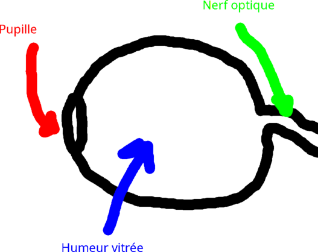

# Fiche de note: cours sur René Descartes

L'individu prend une place prépondérante sur Dieu, dont l'omniscience est questionnée à la Renaissance. L'on commence à penser philosophiquement dans la fin de l'individu (Descartes, Montaigne...): la morale est prise du point de vue de l'action: on cherche une éthique, ce qui est très différent de la scolastique. Définitions: la morale est l'ensemble des prescriptions admises dans une époque et une culture déterminée; l'éthique est la science des jugements du bien et du mal. L'éthique est pratique mais remet aussi en question le pouvoir divin de justice: elle tend à laïciser.

L'homme peut être heureux dans sa vie. Prudence (juger rationnellement avant d'agir), connaissance de soi, se perfectionner et générosité: reconnaître en autrui une personne aux facultés identiques.

L'influence d'Épictète et des stoïciens: nous ne sommes responsables que de ce qui est en notre pouvoir (c'est la faculté d'assentiment). Nous avons un entendement limité et une volonté indéterminée (tous deux infinis pour Dieu). Sagesse, vertu et perfectionnement continus dépendent de nous, mais l'honneur, la richesse ou la pauvreté ne sont pas de notre ressort. Nous sommes libres de nos pensées. Davantage stoïcien: chercher du conforme à la nature, en harmonie avec l'ordre du monde.

Descartes s'inspire de Sénèque: une vie réglée en accord avec la nature qui est réglée: en vue de l'action morale: ce qui permet de trouver la vertu. Mais contrairement aux Anciens, Descartes met l'accent sur la subjectivité, sur l'individu(el). Deux morales: la morale idéale et la morale par provision (morale de la vie quotidienne et pratique). Il propose une critique du stoïcisme: il est rigide (oublie les passions) et met une emphase sur un détachement du sensible (alors que l'humain est sensible: il y a toujours une relation de l'âme et du corps). On ne peut être purement rationnel. La morale doit être accessible à tout un chacun (universelle pragmatiquement).

Descartes compare Épicure, Sénèque, Zénon et Aristote. Sa morale idéale est décrite dans la lettre à Élisabeth du 18 août 1645 (v. [Correspondance](https://fr.wikipedia.org/wiki/Correspondance_avec_%C3%89lisabeth)), qui suit celle du 4 août.

### 4 août 1645:

"la béatitude consiste, ce me semble, en parfaitement contentement d'esprit et une satisfaction intérieure, que n'ont pas ordinairement ceux qui sont le plus favoriés de la fortune, et que les sages acquièrent sans elle. Ainsi *vivere beate*, vivre en béatitude, ce n'est autre chose qu'avoir l'esprit parfaitement content et satisfait" (4 août 1645)

"Or il me semble qu'un chacun se peut rendre content de soi-même et sans rien attendre d'ailleurs, pourvu seulement qu'il observe trois choses, auxquelles se rapportent les trois règles de morale, que j'ai mises dans le *Discours de la Méthode*.

La première est, qu'il tâche toujours de se servir, le mieux qu'il lui est possible, de son esprit, pour connaître ce qu'il doit faire ou ne pas faire en toutes occurrences del a vie.

La seconde, qu'il ait une ferme et ocnstante résolution d'exécuter tout ce que la riason lui conseillera, sans que ses passions ou ses appétits l'en détournent; et c'est la fermeté de cette résolution, que je crois devoir être prise pour la vertu, bien que je ne sache point que personne l'ait jamais ainsi expliquée; mais on l'a divisée en plusieurs espèces, auxquelles on a donné plusieurs noms, à cause des divers objets auxquels elle s'étend.

La troisième, qu'il considère que, pendant qu'il se conduit ainsi, autant qu'il peut, selon la raison, tous les biens qu'il ne possède point sont aussi entièrement hors de son pouvoir les uns que les autres, et que, par ce moyen, il s'accoutume à ne les point désirer; car il n'y a rien que le désir, et le regret ou le repentir, qui nous puissent empêcher d'être contents: mais si nous faisons toujours ce que nous dicte notre raison, nous n'aurons jamais aucun sujet de nous repentir, encore que les événements nous fissent voir, par après, que nous nous sommes trompés, pour ce que ce n'est point par notre faute."

"Au reste, toutes sortes de désirs ne sont pas incompatibles avec la béatitude; il n'y a que ceux qui sont accompagnés d'impatience et de tristesse. Il n'est pas nécessaire aussi que notre raison ne se trompe point; il suffit que notre conscience nous témoigne que nous n'avons jamais manqué de résolution et de vertu, pour exécuter toutes les choses que nous avons jugé être les meilleurs, et ainsi la vertu seule est suffisante pour nous rendre contents en cette vie."

"lorsqu'elle n'est pas éclairée par l'entendement, elle peut être fausse, c'est-à-dire que la volonté et la résolution de bien faire nous peut porter à des choses mauvaises, quand nous les croyons bonnes [...] il faut avouer que la plus grande félicité de l'homme dépend de ce droit usage de la raison, et par conséquent de l'étude qui sert à l"acquérir est la plus utile occupation qu'on puisse avoir, comme elle est aussi sans doute la plus agréable et la plus douce."

### 18 août 1645:

"Je remarque, premièrement, qu'il y a de la différence entre la béatitude, le souverain bien et la dernière fin ou le but auquel doivent tendre nos actions: car la béatitude n'est pas le souverain bien; mais elle le présuppose, et elle est le contentement ou la satisfaction d'esprit qui vient de ce qu'on le possède. Mais, par la fin de nos actions, on peut entendre l'un et l'autre; car le souverain bien est sans doute la chose que nous nous devons proposer pour but en toutes nos actions, et le contentement de l'esprit qui en revient, étant l'attrait qui fait que nous le recherchons, est aussi à bon droit nommé notre fin."

"Je remarque, outre, cela, que le mot volupté  a été pris en autre sens par Épicure que apr ceux qui ont disputé avec lui. Car tous ses adversaires ont restreint la signification de ce mot aux plaisirs des sens; et lui, au contraire, l'a étendue à tous les contentements de l'esprit"

"Or il y a eu trois principales opinions, entre les philosophes païens, touchant le souverain bien et la fin de nos actions, à savoir: celle d'Épicure, qui a dit que c'était la volupté; celle de Zénon, qu ia voulu que ce fût la vertu; et celle d'Aristote, qui l'a composé de toutes les perfections, tant du corps que de l'esprit. Lesquelles trois opinions peuvent, ce me semble, être reçues pour vraies et accordées entre elles, pourvu qu'on les interprète favorablement.

Car Aristote ayant considéré le souverain bien de toute la nature humaine en général, c'est-à-dire celui que peut avoir le plus accompli de tous les hommes, i la eu raison de le composer de toutesl es perfections dont la nature humaine est capable; mais cela ne sert point à notre usage.

Zénon, au contraire, a considéré celui que chaque homme en son particulier peut posséder; c'est pourquoi il a eu assi très bonne raison de dire qu'il ne cosniste qu'en la vertu, pour ce qu'iln 'y a qu'elle seule, entre les biens que nous pouvons avoir, qui dépende entièrement de notre libre arbitre. Mais il a représenté cette vertu si sévère et si ennemie de la volupté, en faisant tous les vices égaux, qu'il n'y a eu, ce me semble, que des mélancoliques, ou des esprits entièrement détachés du corps, qui aient pu être de ses sectateurs.

Enfin Épicure n'a pas eu tort, en considérant en quoi consiste la béatitude, et quel est le motif, ou la fin à laquelle tendent nos actions, de dire que c'est la volupté en général, c'est-à-dire le cotnentement de l'esprit; car, encore que la seule connaissance de notre devoir pourrait obliger à faire de bonnes actions, cela ne nous ferait toutefois jouir d'aucune béatitude, s'il ne nous en revenait aucun plaisir. Mais pour ce qu'on attribue souvent le nom de volupté à de faux plaisirs, qui sont accompagnés ou suivis d'inquiétude, d'ennuis et de repentirs, plusieurs ont cru que cette opinion d'Épicure enseignait le vice; et, en effet, elle n'enseigne pas la vertu."

"C'est pourquoi je crois pouvoir ici conclure que la béatitude ne consiste qu'au contentemnt de l'esprit, c'est-à-dire au cotnentement en général; car bien qu'il y ait des contentements qui dépendent du corps, et les autres qui n'en dépendent point, il n'y en a toutefois aucun que dans l'esprit: mais que, **pour avoir un contentement solide, il est besoin de suivre la vertu, c'est-à-dire d'avoir une volonté ferme et constante d'exécute tout ce que nous jugerons être le meilleur, et d'employer toute la force de notre entendement à en bien juger**." (nous soulignons)

Pour Descartes, la morale commence par la connaissance de soi. Alors une cohérence dans son oeuvre: son *Traité de l'Homme, suivi d'un traité sur la formation du foetus* (rédigé c. 1630, publié posthume en 1664) permet de poser la question de la génétique et du péché originel: l'âme est-elle entâchée dès la naissance ? Pour Descartes, elle est propre mais les expériences de la mère ont une influence.

La morale fait partie du système cartésien de la science. Elle s'obtient par perfectionnement, en réfléchissant l'expérience. La morale est désirable car le bonheur peut être atteint avant la mort (et c'est la même vertu qui pourvoie la félicité dans l'au-delà). Bien utiliser sa raison: bien juger rationnellement permet de faire un choix moralement bon. Le bien est une évidence, on le reconnaît nécessairement: mais le choix du mal reste ouvert car nous avons notre libre-arbitre. Ce pourquoi il faut bien raisonner et bien juger pour bien agir: "Parce que nous avons le libre-arbitre, à nous revient aussi la louange et le blâme".

L'honnête homme n'est pas une classe mais une virtualité universelle: en s'y appliquant, tout un chacun peut s'adapter à  ses conditions, surpasser ses idées reçues et devenir un honnête homme (il faut entendre par "honnête homme" une personne moralement bonne, c'est indépendant du sexe).

L'homme généreux lie sa volonté au parfait discernement: il cherche volontairement le vertueux par le moyen du jugement rationnel en fin du souverain bien. C'est une *résolution volontaire*. Le souverain bien est une vertu, disposition, qui me pousse à développer ma connaissance pour choisir ce qui est meilleur pour moi.

Fortement stoïcien dans sa jeunesse, le décès de sa fille et de son père (tous deux en 1640) change la perspective de Descartes sur les passions: il faut leur laisser un cours mesuré. On ne peut les nier entièrement mais il ne faut pas les pousser à l'excès. Les passions sont neutres chez Descartes: il convient à chacun d'en tirer ce qu'il y a de mieux (pour son bonheur).

## *Méditations métaphysiques* (lat. 1641, fr. 1647)

Descartes propose une nouvelle méthode de la science; elle se fonde sur la détermination d'un indubitable en philosophie.

Le doute hyperbolique (de son enseignement jésuite, de ses sens, des informations de la conscience, de Dieu: on ne sait s'il ne trompe pas nos facultés; le malin génie est distinct du Dieu trompeur) ouvre la possibilité d'accès à la méthode de Descartes pour tout philosophe débutant. C'est un doute méthodique distinct du scepticisme: il cherche une reponse (là où le scepticisme conserve l'aporie): avons-nous accès à la vérité et quelle métaphysique peut nous l'assurer ?

Première vérité de la seconde méditation: je ne peux douter que je doute. Mais l'on ne peut conclure immédiatement le *cogito, sum*. J'existe car en doutant j'ai l'intuition immédiate que je suis un être pensant. Le cogito est une substance qui n'est que pensée (mais l'existence, *sum*, ne se déduit pas si aisément: il ne faut pas sauter les étapes). C'est une prise de conscience. Ce raisonnement ouvre l'ère moderne: la pensée est ramenée à une activité.

A partir de là, Descartes peut découvrir d'autres vérités: le critère de l'évidence. Ce qui est clair et distinct est vrai. Distinguer implique la clarté, mais l'inverse n'est pas vrai: ce qui est clair n'est pas distinct *ipso facto*. Il faut préciser le contenu des idées claires pour les rendres distinctes. Ce procédé méthodologique est au centre de la méthode cartésienne. Toute idée claire et distincte est: indubitable, intuitive, infaillibke et innée. On ne peut s'empêcher de la tenir pour vraie quand elle est reconnue par l'intelligence: mais on peut l'ignorer (liberté du mal volontaire).

L'intuition: une conception qui naît dans un esprit saint et attentif des seules lumières de la raison, est au fondement du raisonnement chez Descartes.

Infaillible: vraie infailliblement car l'intuition n'est pas susceptible d'erreur (au contraire du raisonnement).

L'erreur: se trouve dans le jugement, qui fait intéragir volonté et entendement, car la volonté peut transgresser les limites de l'entendement en tentant de juger de ce que l'on ignore.

De l'intuition peut être conclue la vérité d'une réalité extérieure.

L'idée claire est innée: c'est parce que l'idée de Dieu est ancrée en nous et qu'elle crée nos vérités qu'il faut la prouver. Mais ce "Dieu" devient un Dieu philosophe (c'est un Dieu pensé, en un sens séparé du dogme). Il y a trois preuves de Dieu:

- Méditation III: 1) Je doute, donc je suis imparfait; l'idée de perfection n'est pas à la mesure humaine, 2) J'ai une idée d'infini, alors que je suis fini.
- Méditation V: 3) La preuve ontologique (reprise à Saint Anselme, également réinterprétée par Leibniz et réfutée définitivement par Kant): l'existence est une perfection, or la perfection absolue (de Dieu) contient toutes les perfections.

La connaissance claire et distincte de l'idée de Dieu garantit le système gnoséologique de Descartes. Dieu, donc l'âme, donc le corps: donc les idées des choses sensibles, or, Dieu est bon, donc il ne pourrait vouloir me tromper: le monde extérieur existe véritablement.

Un raisonnement qui n'est pas tout à fait dénué de scolastique, malgré la volonté de Descartes de s'extirper des dogmes philosophiques et de se diriger davantage vers un raisonnement mécaniste (inspiré des mathématiques et notamment de la géométrisation de la mécanique qui se développe à l'époque moderne, par exemple dans les écrits de Galilée).

La méditation IV montre la base de la morale cartésienne. La béatitude du souverain bien est accessible à quiconque trouve sa propre voie de perfectionnement. L'on peut également voir sur ce sujet la Lettre à Christine de Suède du 20 novembre 1647 (p. 271, VRIN). L'entendement fini et la volonté ouvrant sur l'indéfini: il faut maîtriser la volonté pour accéder à la béatitude naturelle.

"Il me semble que le Souverain Bien de tous les hommes ensemble est un amas ou un assemblage de tous les biens, tant de l'âme que du corps et de la fortune, qui peuvent être en quelques hommes ; mais que celui d'un chacun en particulier est tout autre chose, et qu'il ne consiste qu'en une ferme volonté de bien faire, et au contentement qu'elle produit. Dont la raison est que je ne remarque aucun autre bien qui me semble si grand, ni qui soit entièrement au pouvoir d'un chacun. Car, pour les biens du corps et de la fortune, ils ne dépendent point absolument de nous ; et ceux de l'âme se rapportent tous à deux chefs, qui sont, l'un de connaître et l'autre de vouloir ce qui est bon ; mais la connaissance est souvent au-delà de nos forces ; c'est pourquoi il ne reste que notre volonté, dont nous puissions absolument disposer. Et je ne vois point qu'il soit possible d'en disposer mieux, que si l'on a toujours une ferme et constante résolution de faire exactement toutes les choses que l'on jugera être les meilleures, et d'employer toutes les forces de son esprit à les bien connaître. C'est en cela seul que consistent toutes les vertus." (Descartes, Lettre à la Reine Christine de Suède, du 20 novembre 1647)

Selon Descartes, il faut un bien corporel (volupté) et la vertu morale et le plaisir de l'esprit, pour trouver un contentement de l'esprit. La philosophie s'occupe de la médicine, de la métaphysique et de la morale en vue de la joie. Le souverain bien se trouve par l'expérience (c'est une maîtrise) de soi, d'autrui, du corps, de l'esprit, du plaisir, des passions.

Descartes développe sa morale avec des interlocuteurs très différents (théologiens, médecins, philosophes, princesses) dans sa correspondance, mais il écrit aussi en physicien (*Traité des passions de l'âme*, ch. 1 et 2: corps et âme, ch. 3: morale). La question de l'âme et du corps est explorée principalement à la force des questionnements d'Élisabeth. Il cite peu les Anciens (mais il les a lu) et ne s'exprime pas en rhéteur: le physicien explore les causes et les effets des passions (ce qui est nouveau à cette époque).

La morale utile (ou provisoire): connaissance de soi et d'autrui, liberté de l'action volontaire, maîtrise du jugement et des passions (et règles des pays: coutumes). Morale du traité: comment utiliser les passions; idéale de l'homme généreux; méthode pour devenir généreux.

*Correspondance*: ses lettres complètent ses traités en forçant la concision et en poussant l'évolution de ses idées par la transmission de savoir, la forme épistolaire force Descartes à la clarté ce qui fait progresser ses concepts.

Les qualtiés sensibles n'ont de réalité que dans notre âme: le moinde est composé de susbtance matérielle, qui est connue en tant que corps, comme de l'étendue, par l'intuition. L'on peut attribuer des qualités à des natures simples (extension, mouvement) mais ces qualités sont secondes: c'est d'abord le mouvement de la matière. L'étendue intuitive est primordiale dans l'ordre de la connaissance. Les qualités sont un mouvement qui vient *de nous*. Par l'étendue, Descartes entend une forme géométrique ou un espace: l'on voit alors toute l'influence de la physique mécanique sur la philosophie cartésienne. Les mathématiques sont très importantes pour Descartes et guident toute son épistémologie (autant d'un point de vue ontologique (ce qui peut exister) que méthodologique (de quelle manière ce qui peut exister peut être connu). Ses travaux en optique sont un exemple direct de sa maîtrise des mathématiques dans le but de connaître la nature.

Descartes a l'idée d'un espace plein, sans vide, composé uniquement de mouvement de matière infiniment divisible: tout étant forme et mouvement, tout est géoémtrique et calculable. Le corps existe, il tend vers le repos, et la quantité de mouvement est conservée.

Notre corps est motivé par l'âme: notre corps est un principe actif recevant. L'âme est libre (de détermination, de choix) et immortelle, alors que le corps est mortel.

L'âme n'est pas elle-même principe de vie (car les animaux vivent mais ne pensent pas: ils n'ont pas d'âme), mais de son siège corporel, la glande pinéale, elle transmet les esprits animaux au corps; parallèlement comme une éponge, elle absorbe les informations du corps. Descartes incarne l'âme dans le corps par la glande pinéale, mais ne peut admettre qu'elle soit purement corporelle, sinon elle ne serait pas immortelle.

La garantie divine permet d'appliquer justement les règles du *Discours de la méthode*:
1) L'intuition: ne prendre pour certaines que des idées claires et distinctes (ne pa hâter le jugement, éliminier le douter, éviter l'erreur);
2) diviser chacune difficulté d'un problème en parcelles: pour tirer des idées claires;
3) procéder du simple au composé en supposant même del 'ordre là où il n'y en avait pas précédemment (mouvement de ma pensée et mémoire: pas une intuition, mais une sérialisation des intuitions: ce qu'on pourrait appeler un mouvement naturel ou une tendance naturelle à l'ordonnement);
4) dénombrer ou énumérer les étapes après chaque analyse;

Donc 1) intuition, 2) analyse, 3) déduction, 4) induction.

Première méditation: cogito autarcique (sa vérité se confirme par la pensée même) et preuve de l'existence divine par l'idée de perfection. Ainsi l'évidence est une vérité autarcique, opposée en ce sens à la conjecture. D'autre part, l'intuition est un acte de pensée pure (pas de perception sensible impliquée, elle est infaillible (car n'implique qu'elle-même: pas de jugement) et elle s'applique au simple). On la trouve aussi en mathématiques.

Règles 2 et 3: décomposition (inconnu vers connaissable) et recomposition (chaîne causale organisée; principe de non-contradiction). Le premier élément d'un déduction ne peut pas être précédé: il doit être simple. Les idées qui suivent sont dites relatives (à cet élément simple).

Il faut s'exercer pour savoir déduire: prendre une habitude de pensée. Descartes donne une certain attention à la pratique de la pensée, en même temps qu'il ambitionne une méthode universelle: accessible à tout un chacun.

S'il n'y a pas d'ordre naturel (science; physique; mathématiques) alors il faut créer un ordre imaginaire pour les problèmes artificiels.

L'induction est le garde-fou de la volonté qui peut excéder les capacités de l'intelligence durant le raisonnement.

Dans la *Correspondance*: la première lettre d'Elisabeth à Descartes (16 mai 1643): entame la question de l'âme et du corps: si elle est inextensive et immatérielle, comment l'âme peut-elle transmettre au corps laforce de la volonté ? (à ce stade, Elisabeth avait probablement lu les *Méditations* et le *Discours de la méthode*).

"en vous priant de me dire comment l'âme de l'homme peut déterminer les esprits du corps, pour faire les actions volontaires (n'étant qu'une substance pensante). Car il semble que toute détermination du mouvement se fait par la pulsion de la chose mue, à manière dont elle est poussée par celle qui la meut, ou bien de la qualification et figure de la superficie de cette dernière. L'attouchement est requis aux deux premières conditions, et l'extension à la troisième. Vous excluez entièrement celle-ci de la notion que vous avez de l'âme, et celui-là me paraît incompatible avec une chose immatérielle. Pourquoi je vous demande une définition de l'âme plus particulière qu'en votre Métaphysique, c'est-à-dire de sa substance, séparée de son action, de la pensée."

### La première méditation

Descartes attend la maturité (l'âme mûre d'une vie réfléchie) pour écrire ses *Méditations*. Son projet: construire la science sur le fondement stable d'une connaissance véritable et indubitable.

Les sens sont insuffisants pour une vérité première, bien qu'on ne puisse raisonnablement en douter dans la vie pratique. Mais le problème est métaphysique, donc on peut en nier l'utilité épistémique.

Le rêve ne peut être distingué de la réalité, mais Descartes tient un argument fort pour nullifier ce soucis: les données de l'imaginations (représentation d'images déjà perçues) et des sens y seraient aussi fortes que dans la réalité, donc ce n'est pas réellement détrimentaire à la recherche d'une vérité indubitable.

Voir p. 59 - 61, *Méditations métaphysiques*, GF, 2011.

"Toutefois j'ai ici à considérer que je suis homme, et par conséquent que j'ai coutume de dormir et de me représenter en mes songes les mêmes choses, ou quelques fois de moins vraisemblables, que ces insensés, lorsqu'ils veillent. Combien de fois m'est-il arrivé de songer, la nuit, que j'étais en ce lieu, que j'étais habillé, que j'étais auprès du feu, quoique je fusse tout nu ddedans mon lit ?"

"Toutefois il faut au moins avouer que les choses qui nous sont représentées dans le sommeil sont comme des tableaux et des peintures, qui ne peuvent être formées qu'à la ressemblance de quelque chose de réel et de véritable; et qu'ainsi, pour le moins, ces choses générales, à savoir, des yeux, une tête, des mains, et tout le reste du corps, ne sont pas choses imaginaires, mais vraies et existantes."

"Et par la même raison, encore que ces choses générales, à savoir, des yeux, une tête, des mains, et autres semblables, pussent être iamginaires, il faut toutefois avouer qu'il y a des choses encore plus simples et plus universelles, qui sont vraies et existantes, du mélange desquelles, ni plus ni moins que celui de quelques véritables couleurs, toutes ces images des choses qui résident en notre pensée, soit vraies et réelles, soit feintes et fantastiques, sont formées. De ce genre de choses est la nature corporelle en général, et son étendue; ensemble la figure des choses étendues, leur quantité ou grandeur, et leur nombre; comme aussi le lieu où elles sont, le temps qui mesure leur durée, et autres semblables.

C'est pourquoi peut-être que de là nous ne conclurons pas mal, si nous disons que la physique, l'astronomie, la médecine, et toutes les autres sciences qui dépendent de la considération des choses composées, sont fort douteuses et incertaines; mais ue l'arithmétique, la goémétrie, et les autres sciences de cette nature, qui ne traitent que des choses fort simples et fort générales, sans se mettre beaucoup en peine si elles sont dans la nature, ou si elles n'y sont pas, conttiennent quelque chose de certain et d'indubitable. Car, soit que je veille ou que je dorme, deux trois joints ensemble formeront toujours le nombre cinq, et le carré n'aura jamais plus de quatre côtés; et il ne semble pas possible que ces vérités si apparentes puissent être soupçonnées d'aucune fausseté ou d'incertitude."

La pensée précède et permet le rêve: c'est une vérité sûre (pas une sorte d'homologie ontologique).

La mise en relation de natures simples fait l'objet des sciences. Le naturellement simple est intellectuellement indivisible mais n'est pas nécessairement isolée dans son existence: la figure n'existe pas indépendamment de la nature corporelle ou de l'extension.

Natures simples des *Règles pour la direction de l'esprit*: purement intellectuelles; purement matérielles; commune aux deux ordres.

Natures simples:

- Spirituelles: connaissance, doute, ignorance, volition (le vouloir)
- Corporelles: figure (forme, géométrie), étendue, mouvement
- Communes aux deux ordres: existence, (être une) unité, durée

Notions simples des *Principes de la philosophie*: substances intellectuelles; substances corporelles; substance entre l'âme et le corps.

Notions simples:

- Substances intellectuelles: connaître, vouloir.
- Substances corporelles: grandeur, étendue, figure, mouvement, situation, disposition
- Substances entre âme et corps: appétits de boire, de manger, émotions, passions, sentiments (sens)

Notions primitives: âme, corps, âme et corps.

Notions primitives:

- Âme: pensée, perception de l'entendement, inclination de la volonté
- Corps: extension (= étendue), figure, mouvement
- Âme et corps ensemble: union, force (force de l'âme sur le corps, du corps sur l'âme).

Les natures simples sont connaissables par l'homme; par deux sortes de disciplines: les composées (physique, astronomie et médecine) et simples (arithmétique et géométrie). On se trompe moins dans les disciplines simples, les composées sont davantages dubitables.

Dans le première méditation, Dieu peut me tromper, on m'a fait tel que je puisse me tromper: je ne peux donc assurer l'existence de Dieu. Une conclusion: se défaire de ses habitudes de pensée est une lourde tâche qui nécessite du loisir. Dans la vie quotidienne, cela ne pourrait être fait.

L'âme peut être connue par intuition, mais le corps nécessite davantage d'opérations, dont certaines sont faillibles (les sens). Problème de l'union de l'âme et du corps: si l'âme paraît extérieure au corps, c'est parce qu'elel a été connue dans sa forme unie, mais par la pensée pure, elle lui davantage liée ou interne.

Si le corps doit être mû directement par de l'étendue et que l'âme est inétendue, alors comment l'âme agit-elle sur le corps, d'autant plus qu'en-dehors de la méditation durant laquelle ils sont distincts, ils paraissent unis ? (question qu'Elisabeth pose à Descartes).

Lettre du 28 juin 1645 (trouver extrait): Descartes arrive à un point aporétique sur la question de l'union. Il y a trois notions primitives, or: l'âme est conue par l'entendement pur, le corps par l'entendement et l'imagination et l'union par les sens: mais alors on sors du domaine de la métaphysique et l'union ne peut être trouvée par l'exercice de la méditation. Il faut l'expérience de la vie courante. L'union de l'âme et cu corps est une limite de la métaphysique !

Enfin le malin génie: il est moins puissant que Dieu, mais retire les sens, l'imagination, les opinions, les préjugés et les représentations: je ne peux savoir si les objets représentés existent. 

Descartes produit un doute hyperbolique qui ne met cependant pas en doute la faculté de penser (une autre limite de sa méthode de métaphysique).

Le contenu du rêve n'est pas le présent (méditation V ou VI ?).

Après le problème du rêve: le Dieu trompeur? Mais me trompant, je ne peux recevoir l'opinion de l'existence de Dieu. Un ête inférieur m'a donc créé: le malin génie. Je n'ai pu m'autocréer, sinon je serais parfait (je ne me serais pas créé imparfait.

### Seconde méditation:

Le malin génie: mais je ne peux douter que je pense, même si je peux douter du contenu des idées de mes pensées. Le *cogito* est la première vérité de Descartes (mais pas la première dans l'ordre de la connaissance, qui est Dieu).

Il pourrait presque conclure sa première vérité comme étant celle de son *inexistence* (le fait que je n'existe pas étant évident, c'est ma première certitude pour fonder la science). Mais en fait, le "je pense" n'est pas encore un "je suis": c'est simplement la vérité de son existence. Pour penser, il doit exister; mais on ne peut passer facilement de l'un (je pense) à l'autre (j'existe). Dans le *Discours de la méthode*, l'on trouve: *cogito, ergo sum* mais conclure à l'*ergo* c'est sauter les étapes de la pensée: il faut bien établir la logique de l'existence à la pensée. C'est à cela que va servir Dieu. Dans les *Méditations*, Descartes est donc plus rigoureux. D'où l'expression: je suis, j'existe, qui remplace *ergo* par une virgule, évitant ainsi de proposer une implication hâtive de l'existence au fait de penser. Voir p. 73 (*Méditations métaphysiques*, GF, 2011).

L'existence et la vérité sont des intuitions (elles existent d'elles-mêmes).

Dans la scolastique, l'*anima* et le corps sont opposés, ce qui transparaît dfans l'oeuvre de Descartes: *Traité de l'homme* (explication mécaniste du corps); *Méditations métaphysiques*; *Traité des passions*: union de l'âme et du corps. Mais dans la seconde méditation, Descartes distingue entre *anima* et *mens* (p. 75). Puis par *Les principes de la philosophie*, il redéfinit les termes de la scolastique pour les dépasser dans le but de fonder une véritable science. L'un des buts de Descartes, n'est donc pas seulement de proposer un programme scientifique, mais bien de réformer le vocabulaire et les règles de la science dont il a hérité.

L'âme des scolastiques est opposée au corps: elle est principe des fonctions biologiques, sensorimotrices et cognitives. Descartes abandonne ce terme: les animaux vivent, mais ne pensent pas. Il transpose les fonctions vitales (en partie: car demeure le problème de la force de la volonté que fait remarquer Elisabeth) au corps seul et prend le terme de *mens*.

Trois notions primitives: âme - entendement; corps - imagination + entendement (figure, extension, mouvement); union - sensation (dont les passions). Ce sont des intuitions à partir desquelles sont composées les connaissances.

La glande pinéale: article 32 du *Traité des passions...*: c'est le siège de l'âme, lieu d'une double information sensorielle qui est unie en perception par l'esprit (les sens se transmettent par le choc de la lumière et du mouvement, mais ne donnent pas encore d'image formée), les pensées ne s'y forment pas: elles ont un impact sur la glande depuis l'âme, telle une éponge; elle est pensée par analogie avec l'humeur vitrée de l'oeil:

L'âme possède les facultés de sensation et d'imagination, mais deux choses: 1) l'âme étant en perpétuelle perception de quelque sensation, elle est perturbée, donc ces sensations ne sont pas fiables; 2) l'imagination permet de contempler l'image et la figure d'une chose corporelle, elle ne sert que de façon rétrospective et ne peut donc pas permettre de connaître l'âme.

Le morceau de cire (pp. 83 - 87):  il y a trois facultés de connaissance des corps: la sensation, l'imagination et l'entendement. Or seul l'entendement peut les connaître véritablement. Contre le sens commun: les qualités sensibles ne permettent pas de mieux connaître les corps. La cire change en fondant. Ni les sensation ni l'imagination ne peuvent rendre compte des possibilités de changement de la cire: il ne reste qu'une substance matérielle, étendue, une figure flexible et muable. *On ne peut imaginer un chiliogone, mais on peut le concevoir*. L'imagination ne peut fixer son attention que sur un nombre limité de figures. Sous les attributs accidentels de la cire, seul l'entendement peut trouver sa quiddité. Donc dans la seconde méditation: l'entendenement connaît mieux les corps que les sens et l'imagination; l'âme se connaît plus facilement elle-même que les corps (alors que le sens commun estime connaître plus facilement par les sens que par la raison).

"Prenons pour exemple ce morceau de cire, qui vient d'être tiré de la ruche: il n'a pas encore perdu la douceur du miel qu'il contenait, il retient encore quelque chose de l'odeur des fleurs dont il a été recueilli; sa couleur, sa figure, sa grandeur, sont apparentes, il est dur, il est froid, on le touche, et si vous le frappez, il rendre quelque son. Enfin toutes les choses qui peuvent distinctement faire connaître un corps, se rencontrent en celui-ci.

Mais voici que, cependant que je parle, on l'approche du feu: ce qui y restait de saveur s'exhale, l'odeur s'évanouit, sa couleur se change, sa figure se perd, sa grandeur augmente, il devient liquide, il s'échauffe, à peine le peut-on toucher, et quoiqu'on le frappe, il ne rendre plus aucun son. La même cire demure-t-elle après ce changement ?"

Les esprits animaux, par les nerfs, opèrent le va-et-vient de la glande pinéale aux sens. Le mouvement transmis par les sens change la forme de la glande: il l'impacte réellement. Le jugement moral sur le senti est ajouté par la glande. Ces traces sur la glande permettent le souvenir. Lorsqu'elle est utilisée dans le domaine approprié, la connaissance sensible permet de construire un savoir. En elle-même, elle est neutre: donc fiable.

L'union âme-corps prend une plus grande ampleur de problème à partit de 1643, sur l'incitation de la correspondance entre Descartes et Elisabeth: v. par exemple la lettre du 26 juin 1643. L'union connue par expérience, ne sert pas à la métaphysique. La question de l'union apparaît dans la méditation VI.

## Méditation VI

L'union est une idée claire mais non distincte: une intuition et un mélange de sens.

Première réponse à la quatrième objection: l'âme est unie *substantiellement* au corps. L'union n'est pas une substance mais elle est substantielle. L'union se comprend à travers ses substance mais n'est pas une troisième substance: c'est une idée innée que Dieu a mis en nous. l'union c'est se sentir être humain: en quelque sorte, se percevoir intuitivement dans sa forme unie. C'est se sentir exister en tant qu'un.

L'union est une limite de la métaphysique: elle est hors de son domaine. L'union se pense par elle-même, mais reste confuse. Descartes demande à Élisabeth de retourner à l'étonnement primaire de vivre: qu'il appelle aussi admiration.

*Traité des passions*, ch. 3: le souverain bien: l'individu généreux agit moralement bien grâce à la connaissance de la ratinalité; il sait s'estimer et transpose son estime à autrui: il lui confère la disposition de ses propres pensées, c'est-à-dire le libre-arbitre. Il est heureux du fait de chercher à connaître.

Article 152: faire bon usgae du libre-arbitre c'est raisonner sa volonté pour ne pas se tromper. Ainsi l'agumentation de nos connaissances est morale (v. Méditation VI) et correspond à la foi que Dieu a mis en nous en nous attribuant ces facultés.

Article 153: s'estimer (donc ne pas s'ignorer et bien se connaître) est essentiel pour être généreux.

Il y a six passions: amour et haine; joie et tristesse; admiration et colère. L'estime et le mépris découlent de l'admiration, qui est la subite surprise de l'âme qui fait qu'elle se porte à considérer avec attention les objets qui lui semblent rares et extraordinaires. L'admiration a pour objet la connaissance des objets. Mais l'estime (grandeur) et le mépris (petitesse) ajoutent une valeur aux objets par le jugement: ce qui n'est pas purement intellectuel, au contraire de la simple admiration: l'on surajoute une opinion (bien ou mal) et une affection (favorable ou défavorable).

Article 156: la générosité a la même définition que dans les *Méditations métaphysiques*, que la seconde maxime par provision et que dans l'article 32 des *Principes de la philosophie* et se retrouve également dans ses lettres. Elle correspond au mérite de bien user de sa volonté. La définition de la générosité et du libre-arbitre est quasi-identique car l'on ne peut s'estimer que par l'usage que l'on fait volontairement de nos pensées.

Le libre-arbitre et la générosité sont dans une relation circulaire: être généreux c'est faire bon usage de son libre-arbitre, faire bon usage de son libre-arbitre c'est être généreux.

L'estime, en produisant un effet sur le corps par une activité de jugement, permet de contrôler les passions. En s'estimant soi-même, l'on devient aussi à même de juger de l'emploi d'autrui de son libre-arbitre. On ne peut s'estimer que sur ce qui dépend de nous, ce qui permet d'excuser l'autre.

Preuves de l'existende de Dieu dans les *Méditations*: Descartes ne peut être certain de la vérité de son corps. Il analyse alors les éléments de l'idée de Dieu, pour voir s'ils lui appartiennent (pp. 119-121). 

Première preuve de l'existence de Dieu: l'idée innée de l'infini (preuve *a priori*).

Nous sommes à l'image de Dieu: défini par la privation de l'infini de Dieu (nous sommes finis). Notre volonté est indéfinie, ce qui est différent. Descartes reprend un argument scolastique: "l'idée de Dieu est telle que rien de plus grand ne peut être pensé" (Saint-Anselme). L'infini n'est pas compréhensible: c'est une idée innée, claire et distincte mais c'est incompréhensible (on ne pourrait la parcourir, en mesurer l'ampleur).

Cinquième méditation: si Dieu nous conçoit, l'on existe (car l'on aurait pu ne pas exister). Volonté et entendement sont indistincts (identiques) chez Dieu.

Troisième méditation: les preuves de l'infini et de la perfection justifient l'existence de Dieu et donc le fondement de la science.

*A posteriori*: l'idée d'infini nécessite une cause avec au moins autant de réalité (Dieu).

Seconde réponse (p. 291-2): Descartes inverse l'ordre de cette preuve. On ne peut être cause de ce qu'il y a de plus parfait. De surcroît, j'existe, donc Dieu existe, mais je ne me conserve pas: c'est lui qui me conserve. Descartes tourne en rond. C'est une preuve par les effets, par principe de causalité.

L'existence de Dieu est une évidence mais donner une preuve de l'évidence obscurcit son intuition.

Puisque Dieu est tout, augmenter notre connaissance, c'est augmenter notre connaissance de Dieu. Mais l'incompréhensibilité de Dieu est l'idée la plus claire et distincte.

Par l'homme généreux, Descartes laïcise la morale: il le pense en autonomie par rapport au dogme de la religion (l'homme simplement honnête, qui ne connais pas, n'évite donc pas le "péché" de l'ignorance). 

Lettre à Elisabeth du 18 août 1645; comparaison avec Sénèque, Épicure, Zénon et Aristote. La connaissance de Dieu permet aussi le souverain bien car: elle permet d'accepter sa place dans l'ordre des choses (devenir universel). Mais au contraire de l'harmonie naturelle de Sénèque, Dieu étant infini, son harmonie est insaisissable et il est donc mieux de limiter sa volonté de savoir et de se plier à la volonté divine, ce qui offre l'accès à la béatitude (= souverain bien).

Double statut du libre-arbitre: dépendant de Dieu mais libre par la puissance de décision de l'homme. Ferme volotné de diriger son action en vue du souverain bien: c'est limiter la raison par la volonté. Un usage moral du libre-arbitre n'est donc pas absolument libre.

## Méditation III

Les idées: toutes les pensées possibles. Il y a trois inégalies des idées:

1) claire et confuse (ex: l'union);

2) une idée claire et formelle (ex: l'idée de Dieu). 

3) non claire et confuse.i

Mais il ne faut pas se hâter: une idée n'est d'abord véritable qu'en tant que contenu de proposition formelle, c'est-à-dire sans aucun lien à la réalité. Apprécier le vrai et le faux est un jugement qui engage l'entendement et la volonté. La perception intellectuelle est d'abord mise en jeu, si l'idée est claire, elle est vraie, mais si elle est confuse, je ne peux pas me hâter et je dois diviser les étapes de la preuve.

Du fait de la clarté des idées dont elles sont composées, les mathématiques n'ont pas besoin de lien à la réalité extérieure.

À ce stade je ne suis qu'une chose pensante qui a des idées. Mais que faire du malin génie, que j'ai pu penser ? Il faut passer en revue ses idées et y trouver celle de Dieu, qui apporte la stabilité.

Les idées sont des images des choses - elels se distinguent des passions, affections et jugements. Cependant elles sont réuniens avec les passions et affections dans la catégorie des objets sans erreur: ce n'est que le jugement qui est susceptible de fausseté. l'erreur se trouve dans le rattachement à la réalité extérieure.

Trois modes de réceptions des idées (p. 103-107):

1) factices (libre fantaisie, sans lien à la réalité),

2) adventices : survenues de nos choix, représentées par les sens,

3) innées, qu'on ne peut ni perdre ni augmenter.

La vérité (le concept même de vérité) serait une idée innée.

Toutes les idées ont le même degré de formalité, mais pas le même degré d'objectivité (seconde réponse, p. 286):

**Dieu est garant du monde extérieur du fait de sa perfection. Il y a un cercle car il aurait pu être une idée factice.**

Sur la béatitude:

À Élisabeth le 4 août 1645: l'heur (la bonne chance: honneur et richesse) ne dépend pas de nous mais nous avons le libre-arbitre de l'emploi de notre raison. En agissant vertueusement dans les limites de la rationalité, une béatitude, un contentement en notre pouvoir naturel, peut être trouvé.

Les maximes de la morale provisoire:

1) Se servir de son mieux de son esprit,
2) Avoir la ferme et constante résolution d'exécuter ce que notre raison conseillera (même si l'on se trompe par après: il y a plus de valeur à se tromper avec une ferme résolution),
3) Ne pas désirer ce qu iest hors de notre pouvoir (ex: l'heur).

Voir aussi: lettres du 1er février 1647; 20 décembre 1647.
