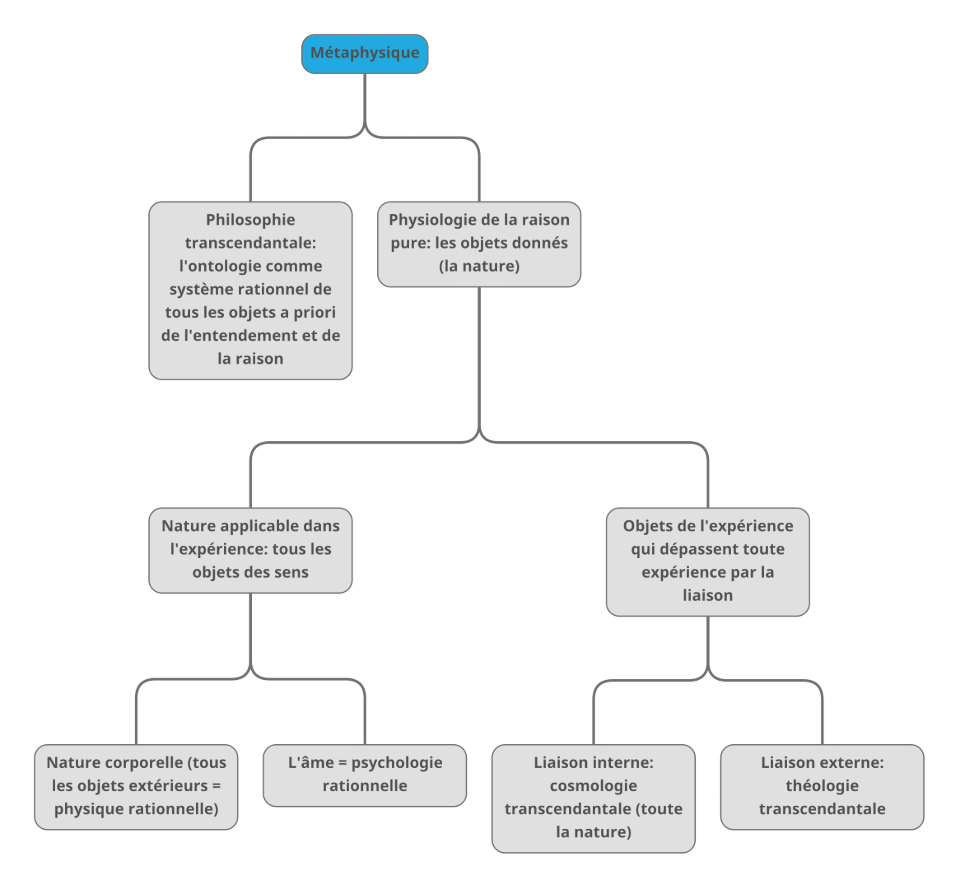

# Fiche de notes: *La Métaphysique*, dir. Élie During, GF, 1998

## I. La métaphysique des autres

### Kant, *La critique de la raison pure*, Préface de la première édition, trad. révisée Barni, GF, 1987, p. 29-32.

Kant envisage la métaphysique de deux manières: comme une science à laquelle l'on est devenu indifférent (car, étant sans expérience, elle ne décide rien, ce qui ne correspond pas à un esprit scientifique de plus en plus empiriste) et en même temps comme un besoin inné. Il se pose alors pour but de résoudre cette indifférence par le tribunal de la *Critique de la raison pure*, c'est-à-dire de juger de ce que cette science sans expérience peut proposer de vrai - et en même temps de déterminer ses illusions. En rétablissant l'authenticité épistémologique de la métaphysique, la métaphysique peut se défaire de l'indifférence qu'elle cause par son apparence de combat sans fin.

Ce faisant, Kant utilise la métaphysique (la connaissance de soi) pour réévaluer l'entreprise métaphysique (la science sans expérience qui est comme un champ de bataille sans fin) et lui attribuer une nouvelle direction (l'épistémologie).

<u>Citations</u>:

"Mais aujourd'hui, il est de mode de lui témoigner un mépris absolu, et la dame, repoussée et abandonnée de tous, s'écrie avec Hécube: *Modo maxima rerum, /Tot generis natisque potens,.../Nunc trabor exul, inops*" (Ovide, Métamorphoses, XIII, 508-510; "Il y a peu la plus grande de toutes, puissante par tant de gendres et de fils... voici maintenant que je suis exilée, depouillée")."

"Il est bien vain, en effet, de vouloir affecter de l'*indifférence* pour des recherches dont l'objet ne saurait être *indifférent* à la nature humaine."

"instituer un tribunal qui, en assurant ses légitimes prétentions, repousse aussi toutes celles de ses exigences qui sont sans fondement, non par une décision arbitraire, mais au nom de ses lois éternelles et immuables. Ce tribunal, c'est la *Critique de la raison pure* elle-même.

Je n'entends point par là une critique des livres et des systèmes, mais celle du pouvoir de la raison en général, [considérée] par rapport à toutes les connaissances auxquelles elle peut s'élever *indépendamment de toutes expériences* ; par conséquent la solution de la question de la possibilité ou de l'impossibilité d'une métaphysique en général, et la détermination de ses sources, de son étendue et de ses limites, tout cela en suivant des principes."

"Toute la question ici soulevée est de savoir jusqu'où je puis espérer d'arriver avec la raison, alors que toute matière et tout concours de l'expérience m'est enlevé."

### Hegel, *Encyclopédie des sciences philosophiques*, Addition au §28, traduction Bourgeois, Vrin, p. 484-486

Si la métaphysique est appliquée toujours comme une activité de l'entendement, à la manière des scolastiques et des anciens, alors elle est mal appliquée. L'entendement, qui est fini et emploie des concepts finis, ne doit pas être appliqué à une réflexion rationnelle du sujet. Il faut donc distinguer une métaphysique de l'entendement d'une métaphysique rationnelle. Pour Hegel, la métaphysique de l'entendement n'est pas vraie bien qu'elle soit justifiée (l'entendement est fini, donc des concepts finis sont propres à une métaphysique finie).

Lorsque le sujet se prend pour objet, il pense de manière infinie: aucune limite unilatérale du type vrai et non-vrai, simple et composé... aucune catégorie de l'entendement ne peut lui être appliqué. La métaphysique rationnelle est infinie car **son objet est total** et que la totalité est une dialectique sans fin. Si le moi est l'objet de la métaphysique, alors elle ne peut être finie.

Si l'on repense à Kant: l'intérêt véritable de la métaphysique ne se trouve pas dans sa réévaluation après la critique (une utilité épistémologique qui permet de mesurer le connaissable par inspection des limites de l'esprit) mais plutôt dans sa visée authentique qui permet, en saisissant l'esprit en action, de distinguer plusieurs ontologies du monde du sujet et notamment le fait que la métaphysique du fini et la métaphysique de la réflexion sont deux faces du même esprit car l'une subsume l'autre. La métaphysique rationnelle permet de surpasser les distinctions de la métaphysique d'entendement.

Cette distinction puissante permet de disserter sur le monde métaphysique auquel un sujet peut prétendre toucher, tout en remettant en question les défis classiques posés à la métaphysique par rapport à son apparente impossiblité: peut-être a-t-elle été mal comprise dans sa visée (le moi confondu avec l'entendement) ou dans son application (téléologie de la finitude qui ne correspond pas à un objet fini, ou inversement). Synthétiquement, la vraie métaphysique est atteinte chez Hegel lorsque le sujet saisit que le vrai est une totalité dans laquelle les concepts de l'entendement se suppriment mutuellement. Faire de la métaphysique passe obligatoirement par une critique de l'histoire de la métaphysique, qui est cependant aussi une révolution ontologique puisque la reconceptualisation de la métaphysique introduit une nouvelle dichotomotie et une nouvelle dialectique dans le sujet pensant, lorsque celui-ci comprend que l'évaluation métaphysique du vrai ne peut pas être unilatérale.

*La métaphysique spéculative, qui est identifiée au vrai, contient en une totalité les oppositions finies de l'entendement.*

<u>Citations:</u>

"Or, en fait, la pensée est, suivant son essence, en elle-même infinie. "Fini" signifie, exprimé formellement, ce qui a une fin, ce qui est mais cesse là où il est en connexion avec son Autre et, par conséquent, est borné par celui-ci. [...] Mais la pensée est auprès d'elle-même, se rapporte à elle-même et a elle-même pour ob-jet. En ayant une pensée pour ob-jet, je suis auprès de moi-même. Le moi, la pensée, est par suite infini parce qu'il se rapporte dans la pensée à un ob-jet qui est lui-même."

"De même, les choses finies se comportent comme *cause* et *effet*, comme *force* et *extériorisation* et, en étant saisies suivant ces déterminations, elles sont connues suivant leur finité. Mais des ob-jets rationnels ne peuvent être déterminés au moyen de tels prédicats finis, et le zèle déployé pour ce faire était le défaut de l'ancienne métaphysique."

"Le vrai, le spéculatif, est par contre ce qui ne comporte en soi aucune détermination unilatérale de ce genre et n'est pas épuisé par elle, mais, en tant que totalité, contient réunies en lui ces déterminations qui pour le dogmatisme valent en leur séparation comme quelque chose de ferme et de vrai."

"Le combat de la raison consiste à surmonter ce que l'entendement a fixé."

### Comte, "Discours sur l'esprit positif" in *Philosophie des sciences*, Tel-Gallimard, 1996, p. 128-136

La métaphysique est l'état bâtard entre la théologie et la positivité. Elle abstrait la divinité théologique et multiplie les arguties, mais reste imprécise et oscille entre deux tendances: l'une prospective (esprit positif) et l'autre rétrospective (esprit théologique). La "champ de bataille" est repris en idée et la métaphysique n'est qu'un état d'esprit de passage entre l'enfance et la maturité de l'esprit selon Comte. Malgré son imprécision et son indécision, elle a du moins pour mérite d'exercer l'esprit aux abstractions et de le détacher progressivement du fétichisme, notamment par l'idée d'une "Nature" unie qu'elle tire abstraitement du Dieu monothéiste. D'autre part elle diversifie les concepts, bien que n'opérant pas d'observations, elle ne puisse jamais en donner une détermination véritablement cruciale, d'où son apparence de champ de bataille. C'est l'observation qui mènera à la positivité en décidant crucialement les arguments (prouvant par l'expérience).

<u>Citations:</u>

"Comme la théologie, en effet, la métaphysique tente surtout d'expliquer la nature intime des êtres, l'origine et la destination de toutes choses, le mode essentiel de production de tous les phénomènes; mais au lieu d'y employer les agents surnaturels proprement dits, elles les remplace de plus en plus par des *entités* ou abstractions personnifiées, dont l'usage, vraiment caractéristique, a souvent permis de la désigner sous le nom d'*ontologie*. Il n'est que trop facile aujourd'hui d'observer aisément une telle manière de philosopher, qui, encore prépondérente envers les phénomènes les plus compliqués, offre journellement, même dans les thé"ories les plus simples et les moins arriérées, tant de traces appréciables de sa longue domination. L'efficacité historique de ces entitées résulte directement de leur caractère équivoque: car, en chacun de ces êtres métaphysiques inhérent au corps correspondant sans se confondre avec lui, l'esprit peu, à volonté, selon qu'il est plus près de l'état théologique ou de l'état positif, voir ou une vértiable émanation de la puissance surnaturelle, ou une simple dénomination abstraite du phénomène considéré. Ce n'est plus alors la pure imagination qui domine, et ce n'est pas encore la véritable observation ; mais le raisonnement y acquiert beaucoup d'extension, et se prépare confusément à l'exercice vraiment scientifique."

"il n'est spontanément susceptible que d'une simple activité *critique* ou dissolvante, même mentale, et à plus forte raison sociale, sans pouvoir jamais rien organiser qui lui soit propre." 

"On peut finalement envisager l'état métaphysique comme une sorte de maladie chronique inhérente à notre évolution mentale, individuelle ou collective, entre l'enfance et la virilité."

### Engels, *Anti-Dühring*, trad. É. Bottigelli, Éditions Sociales, 1963, p. 52-55

Engels reprend la dialectique hégélienne comme un matérialisme historique et l'utilise pour critiquer la science: celle-ci est confuse car elle est encore trop métaphysique.

Il donne pour origine à la métaphysique en science les travaux de Bacon et Locke, qui l'ont rendu étroite et dogmatique: elle n'a pas de visée d'ensemble d'un ou de plusieurs systèmes de changement intriqués par des relations de cause et d'effet. Elle ne saisit pas la métaphysique rationnelle du monde (et Hegel par le moyen de sa téléologie de l'Esprit, retourne la métaphysique rationnelle vers une forme d'essentialisme de l'entendement en faisant abstraction d'un devenir historique et en asseyant une fois pour toute une superstructure dialectique, ce que résout le matérialisme historique en situant la dialectique dans une dynamique locale).

Seulement quelques penseurs, en science de la nature, dont Darwin, ont le mérite d'adopter une approche dialectique qui subsume les faits historiques sans participer à une métaphysique d'entendement (unilatérale). Mais l'approche métaphysique reste dominante selon Engels, il faut donc travailler à son encontre (situation de la science dans la deuxième moitié du XIXème siècle).

<u>Citations:</u>

"Pour le métaphysicien, les choses et leurs reflets dans la pensées, les concepts, sont des objets d'étude isolés, à considérer l'un après l'autre et l'un sans l'autre, fixes, rigides, donnés une fois pour toutes. Il ne pense que par antithèses sans moyen terme: il dit oui, oui, non, non ; ce qui va au-delà ne vaut rien. Pour lui, ou bien une chose existe ou bien elle n'existe pas ; une chose ne peut pas non plus être à la fois elle-même et une autre."

"devant les objets singuliers, elle oublie leur enchaînement ; devant leur être, leur devenir et leur périr ; devant leur repos, leur mouvement ; les arbres empêchent de voir la forêt."

"ce qui était effet maintenant ou ici, devient cause ailleurs ou ensuite, et *vice versa*. Tous ces processes, toutes ces méthodes de pensée n'entrent pas dans le cadre de la pensée métaphysique"

"dialectiquement et non métaphysiquement, que la nature ne se meut pas dans l'éternelle monotonie d'un cycle sans cesse répété, mais parcourt une histoire effective. Avant tout autre, il faut citer ici Darwin, qui a porté le coup le plus puissant à la métaphysique de la nature en démontrant que tout la nature organique actuelle, les plantes, les animaux, et par conséquent, l'homme aussi, est le produit d'un processus d'évolution qui s'est poursuivi pendant des millions d'années."

### Nietzsche, *Le Crépuscule des Idoles*, trad. Albert, GF-Flammarion, 1985, p. 91-93

Substantialiser et révérer des substances: les croire supérieures au devenir. C'est l'erreur métaphysique de croire à des erreurs rationelles face à ce qui devient. Cette raison momifiante est présente jusque dans la grammaire qui dissèque l'action, ou le devenir, ou le mouvement: sujet, verbe, complément. Ces tripartition idéelle du langage fait conceptualiser rationellement des développement divisés de l'apparence, du sujet du mouvement, etc, qui n'auraient jamais eu lieu d'être. L'être n'est pas distinct du devenir. La métaphysique, qui distingue l'apparent des choses, est une erreur de conception qui s'est même immiscée dans le langage.

<u>Citations:</u>

"Toutes les valeurs supérieures sont de premier ordre, toutes les conceptions supérieures, l'être, l'absolu, le bien, le vrai, le parfait - tout cela ne peut pas être "devenu", il *faut* donc que ce soit *causa sui*. Tout cela cependant ne peut pas non plus être inégal entre soi, ne peut pas être en contradiction avec soi.... C'est ainsi qu'ils arrivent à leur conception stupéfiante de "Dieu"... La chose dernière, la plus mince, la plus vide est mise en première place, comme cause en soi, comme *ens realissimum*... Qu'il ait fallu que l'humanité prenne au sérieux les élucubrations de ces cerveaux malades ! - Et elle a dû payer cher pour cela !..."

"Le langage appartient, par son origine, à l'époque des formes les plus rudimentaires de la psychologie: nous entrons dans un grossier fétichisme si nous prenons conscience des conditions premières de la métaphysique du langage, c'est-à-dire de la *raison*. Alors nous voyons partout des actions et des choses agissantes: nous croyons à la volonté en tant que cause en général : nous croyons au "moi", au moi en tant qu'être, au moi en tant que substance, et nous projetons la croyance en la substance du moi sur toutes les choses - par là nous *créons* la notion de "chose"... Partout l'être est imaginé comme cause, *substitué* à la cause ; de la conception du "moi" suit seulement comme dérivation, la notion de l'"être"..."

"La "raison" dans le langage: ah ! quelle vieille femme trompeuse ! Je crains bien que nous ne nous débarrassions jamais de Dieu, puisque nous croyons encore à la grammaire..."

### Mach, *La Connaissance de l'Erreur*, trad. Dufour, Flammarion, 1908, p. 22-26

La métaphysique trouve sa source dans deux erreurs: dans la croyance que les deux parts de la limite spatiale U (*Umgrenzung*, limite) (le psychique et le physique) n'opéreraient pas selon la même logique, alors que de fait on n'y trouve que des relations que la connaissance pleine des circonstance de perception permet de déterminer scientifiquement (il n'y a pas un monde des objets (psychique) et un monde des relations (physique) comme chez Kant); dans l'habitude par imagination de suppléer la représentation des perceptions par des choses usuelles, connues par culture, qui de fait crée des apparences trompeuses, en supprimant la relation des apparences par une chose unique (un objet habituel).

Mach donne à l'expérience humaine le caractère épistémologique d'une expérience scientifique afin de produire une norme antimétaphysique pour évaluer les faux problèmes. Le métaphysique surgit quand la relation des apparences et leurs circonstance de production ne sont pas connues, donc lorsque l'expérience humaine n'est pas proprement déterminée.

<u>Citations:</u>

Une métaphysique imaginative de la perception: "Notre imagination complète ce que nous fournit l'expérience de la façon qui nous est *la plus habituelle*, et fausse quelque fois, par cela même, nos perceptions. Ainsi, ce qui conduit à opposer l'apparence et la réalité, le *phénomène* et la *chose*, c'est la confusion des perceptions produites par les circonstances les plus différentes avec des perceptions produites par des circonstances *parfaitement déterminées*."

"Considérons les éléments rouges, vert, chaud, froid, etc. : quel que soit leur nom, ils sont immédiatement donnés. Ils dépendent d'éléments extérieurs à U (éléments *physiques*) et d'éléments intérieurs à U (éléments *psychiques*) ; mais, dans les deux cas, ils sont toujours *les mêmes*, ce sont toujours des données immédiates. [...] Nous avons devant nous à la fois les éléments du monde réel et les éléments du moi. La seule chose qui puisse nous intéresser, en dehors de cela, c'est la *dépendance fonctionnelle* (au sens mathématique) de ces éléments *entre eux*. On peut appeler cette dépendance des éléments une *chose*, mais ce n'est pas une chose *inconnaissable*. Toute observation nouvelle, toute proposition scientifique nous fait avancer dans la connaissance de cette chose.""

"mettre sous la forme la plus simple et la plus transparente les deux problèmes de la chose insondable, et du moi également impénétrable, et de les faire par là même reconnaître comme de *pseudo-problèmes*. Si nous excluons ce dont la recherche n'a aucun sens, nous n'en verrons apparaître que plus nettement ce que nous pouvons réellement atteindre par les *sciences particulières: toutes les relations et les différents modes de relations des éléments entre eux.*"

"Chose et moi sont des fictions provisoires de même espèce."

"Nos considérations [...] conduisent seulement le savant à écarter les pseudo-problèmes qui el troublent, et elles laissent le reste à la recherche positive."

Quid de la phénoménotechnique de Bachelard ? Répète-t-elle le pseudo-problème de la chose kantienne ?

### Ayer, *Langage, vérité et logique*, trad. Ohana, Flammarion, 1956, p. 36-37 et 48-52

Les seuls propositions sensées sont *a priori* ou peuvent être déterminées par une expérience sensorielle.

La métaphysique constitue le groupe des propositions insensées. Le langage lui-même contient une habitude métaphysique: celle de chosifier les apparences de manière moniste, c'est-à-dire de distinguer entre la chose et les apparences, alors que la relation réciproque des apparences constitue déjà la chose. Le critère de vérifiabilité, qui est un critère de signification, permet de distinguer les propositions métaphysiques des propositions factuelles.

Ayer, qui côtoye le <a href="https://fr.wikipedia.org/wiki/Cercle_de_Vienne">Cercle de Vienne</a> et introduit sa pensée au monde anglo-saxon, montre la claire influence de Mach.

Les questions métaphysiques sont des questions mal posées. Une véritable métaphysique est un discours sur la logique de la vérité destiné à épurer la vérité des erreurs métaphysiques.

<u>Citations:</u>

"Comme Hume, je divise toutes les propositions authentiques en deux classes: celles qui, dans sa terminologie, concernent les "relations d'idées" et celles qui concernent les "matières de fait". La première classe comprend les propositions *a priori* de la logique et des mathématiques pures, que je ne considère comme nécessaires et certaines que parce qu'elles sont analytiques. [...] la raison pour laquelle ces propositions ne peuvent être démenties par l'expérience est qu'elles ne font aucune assertion au sujet du monde empirique, mais indiquent simplement notre détermination d'user de symboles d'une certaine manière. Par contre, les propositions empriqiues concernant les matières de fait, je soutiens qu'elles des hypothèses qui peuvent être probables, mais jamais certaines. Et en exposant la méthode de leur validation, je prétends aussi élucider la nature de la vérité."

"Car j'exige d'une hypothèse empirique, non qu'elle soit vérifiable, en effet, d'une manière concluante mais que quelque expérience sensorielle puisse être invoquée pour la détermination de sa vérité ou de sa fausseté.

Si une proposition présumée ne satisfait pas à ce principe, et n'est pas une tautologie, alors je soutiens qu'elle est métaphysique, et qu'étant métaphysique, n'est n'i vraie ni fausse, mais littéralement dépourvue de sens."

"Nous pouvons en conséquence définir un énoncé métaphysique comme un énoncé qui vise à exprimer une proposition authentique, mais n'exprime en fait ni une tautologie, ni une hypothèse empirique. Et comme les tautologies et les hypothèses empiriques forment la classe entière des propositions sensées, nous sommes en droit de conclure que toutes les assertions métaphysiques sont des non-sens."

"L'analyse logique montre que ce qui fait de ces "apparences" les "apparences" de la même chose, ce n'est pas leur relation à une entité autre qu'elles-mêmes, mais leurs relations réciproques. Cela échappe au métaphysicien parce qu'il est égaré par un caractère grammatical superficiel de son langage."

## II. Ontologie ou métaphysique ?

### Aristote
#### *Métaphysique*, A, 1

La métaphysique est la science des causes premières: c'est la science la plus libre. Il faut toujours prendre, au sens grec et notamment au sens athénien, la liberté comme étant celle du citoyen et donc se définissant négativement par rapport à la liberté de l'esclave. Être libre c'est être libre de son corps, et avoir le temps libre de cultiver une pensée critique afin de participer aux affaires de la cité ([voir](../polpla)). Cette science prend source dans l'étonnement philosophique (qui consiste à vouloir résoudre un problème): c'est connaître et savoir pour connaître et savoir.

<u>Citations:</u>

"Connaître et savoir pour connaître et savoir: tel est le caractère principal de la science du suprême connaissable, car celui qui veut connaître pour connaître choisira de préférence la science parfaite, c'est-à-dire la science du connaissable par excellence."

"le connaissable par excellence, ce sont les principes et les causes: c'est par eux et à partir d'eux que les autres choses sont connues"

"La science la plus élevée, et qui est supérieure à toute science subordonnée, est celle qui connaît en vue de quelle fin il faut faire chaque chose. Et cette fin est le bien de chaque être, et, d'une manière générale, c'est le souverain Bien dans l'ensemble de la nature."

"il résulte que c'est à la même science que s'applique le nom de philosophie: cce doit être, en effet, la science théorétique des premiers principes et des premières causes, car le bien, c'est-à-dire la fin, est l'une de ces causes."

"Mais, de même que nous appelons homme libre celui qui est à lui-même sa fin et n'est pas la fin d'autrui, ainsi cette science est aussi la seule de toutes les sciences qui soit libre, car seule elle est sa propre fin."

"De tant de manières, en effet, la nature de l'homme est esclave que, suivant Simonide, "Dieu seul peut jouir de ce privilège" "

"Dieu paraît bien être une cause de toutes choses et un principe, et une telle science, Dieu seul, ou du moins Dieu principalement, peut la posséder. Toutes les autres sciences sont donc plus nécessaires qu'elles, mais aucune ne l'emporte en l'excellence." 

#### *Métaphysique*, G, 1 et 2

"to on hè on", science de l'être en tant qu'être: "hè" ici prend un sens restrictif, c'est l'être en tant qu'il est tout court. Trouver les causes premières de l'être en tant qu'être ne se distingue pas dans l'entreprise pour Aristote, d'une exploration de toutes les catégories d'être et de leur mode de génération. 

Cependant une science plus première subsume toutes les autres: la proposition "*un* homme est" est identique à "*homme* est" (le particulier est identique à son principe général). 

Il y a un double mouvement de l'Être à l'être (du général au particulier) et de l'être à l'Être (du particulier au général) afin de trouver le principe de l'Être en tant qu'être (ce qui fait l'Être de tout être, le principe de tous les principes généraux).

Seul le philosophe, qui s'étonne et cherche les causes premières, peut s'adonner à cette recherche: le dialecticien ne cherche que la critique et le sophiste ne produit que l'apparence de la philosophie, aucunement le contenu. Seul un véritable étonnement philosophique est à même d'entamer la recherche des causes premières, qui est la plus libre de toutes.

<u>Citations:</u>

De l'introduction par Élie During:

"La solution consiste à rappeler que l'objet propre d'une science est ce qui est *premier* dans son ordre, et que, précisément, les sens multiples de l'être peuvent se dire par référence à une unité (*pros hèn*), à un seul sens primordial de l'être, la substance (*ousia*). Par le truchement de cette signification fondamentale, on fera *comme si* l'être était un genre, tout en s'interdisant d'en faire un super-genre, c'est-à-dire de l'hypostasier comme une réalité séparée, transcendante, universelle." 

"Tel est le double mouvement qui inaugure le jeu métaphysique: on ouvre la philosophie à la dialectique des contraires pour lui donner l'articulation d'une science, mais on maintient l'être en tant qu'être dans le sillage de la substance, pour en préserver l'unité."

Du texte: 

"C'est pourquoi une science génériquement une traitera de toutes les espèces de l'Être en tant qu'être, et ses divisions spécifiques, des différentes espèces de l'Être."

"l'Être et l'Un sont identiques [...] on n'exprime pas quelque chose de différent, à raison du redoublement des mots "un homme est", au lieu de "homme est". "

"Si ce n'est pas l'office du philosophe, qui est-ce qui examinera si "Socrate" est identique à "Socrate assis", si une seule chose a un seul contraire, ce qu'est le contraire, en combien de sens il est, pris ?"

"Tous les êtres sont, en effet, ou des contraires, ou des composés de contraires, et les principes des contraires sont l'Un et le Multiple. Or ces dernières notions rentrent dans une même science, qu'elles soient, ou, comme il est probablement plus vrai de le soutenir, qu'elles ne soient pas dites selon un terme unique. Cependant, même si l'Un se prend en de multiples acceptions, les autres acceptions se rapportent cependant toutes à un terme premier, et il en est de même pour les contraires de l'Un. C'est ce qui arrive, même si l'Être ou l'Un n'est pas universel, et identique dans tous les individus, ou s'il n'est pas séparé des individus, ainsi que probablement, en fait, il ne l'est pas, même si l'unité signifie cependant tantôt une simple relation à l'égard d'un terme unique, tantôt une unité de consécution."

#### *Métaphysique*, E, 1

La science de l'être en tant qu'être est la science du plus général, donc: de l'immobile et du séparé (séparé de la génération, des accidents, des catégories, de toute région matérielle de l'être). Parmi les sciences spéculatives, les mathématiques ne sont pas séparées (elle s'appliquent à des objets matériels malgré des objets immobiles) et la physique (connaissance de la nature: de la génération des objets naturels) traite de mobiles non-séparés. La science de l'Être en tant qu'être, si elle est possible, doit être plus générale que ces sciences spéculatives: alors elle peut se présenter en tant que théoologie (le plus général étant aussi le plus divin).

La question du champ d'objet propre à cette science est résolue logiquement par Aristote en excluant les principes généraux des sciences les plus générales (mathématique et physique) qui auraient pu y prétendre. Elle n'est donc ni science du mobile ni de l'attaché à des objets matériels: science de l'extrinsèque à toute nature et toute matérialité. 

Elle cherche à connaître le principe des objets immobiles et séparés, de tout objet dont elle serait la cause dans un sens non-naturel, non-pratique et non-poétique: car les causes correspondantes sont immanentes (l'action de la pratique a pour cause le choix qui se trouve dans le sujet de l'action, la poétique a pour cause l'artiste, les objets de la nature ont leur propre cause de croissance).

<u>Citations:</u>

De l'introduction par Élie During:

"La philosophie première est donc seule à traiter sans restriction des réalités séparées et immobiles, c'est-à-dire susbtantielles et impérissablse."

"Mais l'être en tant qu'être concerne en droit les anges comme les règles du tennis de table, les orbes célestes comme les choux."

Du texte:

"Des choses définies et des essences, les une sont comme le camus, les autres, comme le concave, et la différence consiste en ce que le camus est engagé dans la matière, car le camus, c'est le nez concave, tandis que la concavité est indépendante de la matière sensible. Or, si tous les objets naturels sont du même type que le camus, par exemple le nez, l'oeil, le visage, la chair, l'os, et, en général, l'animal, et aussi la feuille, la racine, l'écorce, et, en général, la plante (car aucun de ces objets ne peut être définir sans le mouvement, mais ils ont toujours une matière), on voit alors comment il faut, dans les êtres physiques, rechercher et définir l'essence"

"la science première a pour objet des êtres à la fois séparés et immobiles"

"Maintenant, toutes les premières causes sont nécessairement éternelles, mais surtout les causes immobiles et séparées, car ce sont les causes des choses visibles parmi les choses divines. Il y a donc trois sciences théorétiques: la mathématique, la physique, et la théologie. [...] Les sciences théorétiques sont les plus hautes des sciences, et la théologie est la plus haute des sciences théorétiques."

"Nous répondrons que s'il n'y avait pas d'autre substance que celles qui sont constituées par la nature, la physique serait la science première. Mais s'il existe une substance immobile, la science de cette substance doit être antérieure et doit être la philosophie première ; elle est aussi, de cette façon, universelle parce qu'elle est première. Il lui appartiendra de considérer l'Être en tant qu'être, c'est-à-dire à la fois son essence et les attributs qui lui appartiennent en tant qu'être."

### Avicenne, *La Métaphysique du Shifâ'*, l. I, 1-2, trad. Anawati, Vrin, 1978, p. 86-87, 93-95.

Métaphysique: *ma ba'd al-tabîa*, "ce qui vient après la nature".

Avicenne reprend à son compte la conception aristotélicienne de la philosphie première et l'unifie clairement: c'est la science suprêmement noble, suprêmement vraie et des causes premières de tout. Il fait évoluer cette définition: elle est aussi **science de l'existant causé en tant qu'il est existant causé**: l'existence de l'être en tant qu'être ne se justifiant pas par un principe.

Cette science se précise comme une théologie: le contenu de l'existence de Dieu comme cause de tout. Comme l'Être aristotélicien, la cause première possède des accidents qui ne sont pas des divisions, mais font partie de l'universel absolu: la substance, la quantité, la qualité; l'un et le multiple, la puissance et l'acte, l'universel et le particulier, le possible et le nécessaire (des contraires transcendantaux). Mais l'existence de Dieu est la première cause: elle est non-causée et en tant que cause, n'est pas un sujet de métaphysique (bien que le *contenu* de l'existence de Dieu soit un sujet légitime de recherche).

Généralement, elle est science de tout ce qui est sans matière, donc s'étend des premières causes à toutes les distinctions immatérielles du réel, dont les principes abstraits des sciences (physique, mathématiques).

<u>Citations:</u>

"Tu entendais parfois dire que la sagesse est la science la plus noble du plus noble des objets connaissables ; d'autres fois que la sagesse c'est la connaissance qui est la plus vraie et la plus précise des connaissances. Enfin, quelques fois, qu'elle est la science des causes premières du tout. [...] ces trois propriétés qui décrivent la sagesse sont des propriétés d'une même discipline, celle-là même que nous étudions."

"Or l'existence de Dieu - qu'il soit exalté - ne peut pas être admise dans cette science, mais elle y est recherchée [...] il est clair que tous ces sujets resortissent à la science qui s'occupe de ce dont la subsistance ne dépend pas des sensibles. Le seul sujet commun entre eux, dont ils seraient tous des modes et des accidents, c'est l'existant. Certains d'entre eux sont des usbstances, d'autres des quantités, d'autres d'autres catégories. Il est impossible qu'il y ait d'autre notion vérifiée qui les englobes tous gormis l'existence, la notion d'existence."

"Aussi le sujet premier de cette science est-il l'existant en tant que tel ; et le domaines de ses recherches sont les choses qui l'accompagnent nécessairement en tant qu'existant sans conditions." (à propos des accidents essentiels, ou "conditions concomitantes" que sont la quantité, la qualité, la substance)

"De plus, le principe n'est pas principe de l'existant dans sa totalité. S'il était principe de l'existant dans sa totalité, il serait principe de lui-même. Or l'existant pris dans sa totalité n'a pas de principe ; le principe n'est principe que de l'existant causé. Le principe est donc principe d'un certain existant." Déduction de l'impossibilité de trouver une cause à la cause première (Dieu est absolument premier).

"Dès lors, les questions de cette science seront les causes de l'existant causé en tant qu'existant causé, d'autres enfin les accidents de l'existant, d'autres concernent les principes des sciences particulières. C'est là la science qui est traitée dans cette discipline."

"elle est la meilleure science, la certitude, à l'égard de l'objet connaissable le plus noble qui est Dieu, qu'Il soit exalté, et des causes qui viennent après Lui."

### Thomas d'Aquin, *Expositio super Librum Boerthii de Trinitate*, V. 5, éd. B. Decker, Leyde, 1959

La philosophie première a deux méthodes de recherche et donc une division des sujets.

Tout d'abord la métaphysique des philosophes concerne des chosses immatérielles et immobiles et parmi ces choses certaines qui ne sont pas transcendantales et qui ne peuvent pas (par définition) apparaître dans la matérialité: Dieu et les anges. Mais justement, la métaphysique n'est en mesure de définir la recherche théologique que comme une recherche des principes de tout et non comme un sujet. La raison en est que la théologie révélée seule pose Dieu et les immatériels purs comme son sujet, alors qu'elle n'est pas accessible au philosophe: elle est révélée par les Saintes Écritures. Il faut donc **distinguer métaphysique philosophique et métaphysique révélée**.

<u>Citations:</u>

De l'introduction par É. During:

"Les mathématiques [...] elles s'occupent de formes qui ne sont séparables ni du mouvement ni de la matière, mais qui peuvent n"anmoins êtres considérées sans matière et sans mouvement, par une certaine opération de l'intelligence, l'abstraction."

Citant d'Aquin: "Il y a ensuite d'autres objets de spéculation qui ne dépendent pas pour leur existence de la matière, et qui sont capables d'exister séparément dans la matière, soit qu'ils n'existent jamais dans la matière, comme Dieu et les anges, soit qu'ils exisent quelquefois dans la matière, et quelquefois non, comme la substance, les qualités, la puissance et l'acte, l'un et le multiple, etc."

Il faut distinguer "la théologie révélée et la théologie naturelle (philosophie) et "L'être du métaphysicien, il faut donc le saisir dans ce qui le sépare radicalement de l'être matériel en tant que matériel, aussi bien que de l'être immatériel en tant qu'immatériel."

"Ce qui intéresse le métaphysicien, c'est l'immatérialité des *transcendantaux*. [...] *L'être en tant qu'être n'a pas l'immatérialité des choses immatérielles ; il est l'immatérialité même des choses en tant que choses.*"

Du texte:

"Mais, de même que pour tout genre de l'être, il y a des principes communs à tout ce qui tombe sous ce genre, de même tous les êtres, par cela même qu'ils ont de l'être en commun, ont des principes communs qui sont les principes de tout être. Avicenne dit que les principes peuvent être dits communs en deux sens: communs par prédication, dans le sens où ce que j'appelle *forme* est commun à toute forme en se trouvant prédiqué de chacune ; et communs par causalité, dans le sens où l'on dit que le soleil est l'unique principe de tout ce qui est soumis à la génération. Or il y a des principes qui sont communs à toute être, non seulement au premier sens - celui où Aristote parle de commun à tous les êtres par proportionnalité ou analogie -, mais également dans le second sens - car les choses peuvent être ramenées [*reducuntur*: littéralement, "réduites"] à ertains principes dans un ordre défini, les principes des accidents renvoyant aux principes des substances, et les principes des substances périssables renvoyant aux principes des ubstances impérissables, et ainsi de suite en remonter l'échelle [des êtres]" Il serait intéressant ici de faire un lien à <a href="https://classiques.uqam.ca/classiques/janet_pierre/intelligence_langage/intelligence.html">Pierre Janet et son analyse philosophique de la manière dont les objets quotidiens forment une métaphysique pratique</a>, par exemple l'échelle qu'il analyse explicitement.

Immatériel donc en acte: "selon Aristote l'être en acte est premier et plus parfait que l'être en puissance"

"Mais puisque les principes ultimes, quoique plus connaissables en soi, sont comme dit Aristote, *préesnts à notre esprit comme la lumière do soleil aux yeux du hibou*, la lumière naturelle de notre raison ne peut les pénétrer qu') travres leurs effets: et c'est bien là la manière dont les philosophes ont péntérés, comme ilest dit dans les *Romains*, I, 20: *Les perfections invisibles de Dieu sont visibles dans ses oeuvres pour l'intelligence*. [...] l'être en tant qu'être [*ens inquantum est ens*] [...] Mais il est une autre voie pour connaître ces choses, non pas dans la manière dont elles se manifestent par leurs effets, mais telles qu'elles se manifestent en elles-mêmes."

"De sorte qu'il y a deux théologies ou sciences divines: dans l'une les choses divines ne sont pas le sujet de la science, mais seulement les principes de ce sujet, et c'est celles que les philosophes pratiques, en l'appelant aussi métaphysique ; dans l'autre les choses divines sont considérées en elles-mêmes comme le sujet de cette science, et cette théologie est celle qu'enseignent les Saintes Écritures."

"les chose par définition n'existent pas nécessairement dans la matière et le mouvement, mais peuvent exister séparément d'eux, et quelques fois exister en eux, et c'est là le sens où l'être et la substance, la puissance et l'acte, existent séparément de la matière et du changement, ne dépendant ni de la matière ni du mouvement pour exister, contrairement aux objets mathématiques, lesquels ne peuvent exister que dans la matière, bien qu'ils puissent être saisis par abstractiuon de la matière sensible. La théologie philosophique considère comme son sujet propre les choses séparées au second sens, et traite des choses séparées au premier sens comme des principes de son sujet. Mais la théologie des Saintes Écritures traite dans son sujet des choses séparées au premier sens, bien qu'ils lui arrive aussi, dans la mesure où l'exige la révélation des choses divines, de traiter de certaines choses en mouvement dans la matière."

### Descartes, Lettre-Préface des *Principes de la philosophie*, GF-Flammarion, 1996, p. 71-75

La métaphysique est le fondement de l'arbre de la connaissance. Elle cherche les causes premières, mais elle n'est pas révélée. Elle est trouvée rationnellement mais ne sert pas à elle-même (connaître et savoir pour connaître et savoir d'Aristote): elle reste à fonder. Le fruit de l'arbre, trouvé à son extrémité, est la morale. La métaphysique est le fondement de toute la connaissance, mais fonde rla métaphysique n'est entrepris que pour assurer (par déduction) une connaissance véritable et donc une bonne vie. La métaphysique est au service de l'épistémologie, l'épistméologie est au service de la morale. L'importance de la morale est thématique de la Renaissance (ravivan les soucis grecs), mais également d'un époque troublée par des guerres: Descartes fut soldat dans sa jeunesse.

D'autre part, en suivant un programme pédagogique clair, l'individu lambda peut accéder à la métaphysique: elle n'est pas surhumaine d'un point de vue didactique.

<u>Citations</u>

1) "se former une morale qui puisse suffire pour régler les actions de sa vie"
2) "Après cela, il doit aussi étudier la logique: non pas celle de l'École [...] mais celle qui apprend à bien conduire sa raison pour découvrir les vérités qu'on ignore  ; et parce qu'elle dépend beaucoup de l'usage, il est bon qu'il s'exerce longtemps à en pratiquer les règles en touchant des questions faciles et simples, comme sont celles des mathématiques."
3) "Puis, lorsqu'il s'est acquis quelque habitude à trouver la vérité en ces questions, il doit commencer pour de bon à s'appliquer à la vraie philosophie, dont la première partie est la métaphysique qui conteint les principes de la connaissance, entre lesquels est l'explication des principaux attributs de Dieu, de l'immatéralité de nos âmes, et de toutes les notions claires et simples qui sont en nous. La seconde est la physiques [...] En suite de quoi [...] la nature des plantes, celles des animaux et surtout celle de l'homme ; afin qu'on soit capable de trouver par après les autres sciences qui lui sont utiles"
4) "Ainsi toute la philosophie est comme un arbre dont les racines sont la métaphysique, le tronc est la physique, et les branches qui sortent de ce tronc sont toutes les autres sciences, qui se réduisent à trois principales, à savoir la médecine, la mécanique et la morale ; j'entends la plus haute et parfaite morale, qui, présupposant une entière connaissance des autres sciences, est le derné degré de la sagesse."

"la principale utilité de la philosophie dépend de celles de ses parties qu'on ne peut apprendre que les dernières."

### Leibniz, *Nouveaux essais sur l'entendment humain*, IV, 8, "Des propositions frivoles", §9-11, GF-Flammarion, 1990, p. 339-341

Philalèthe (représentant <a href="https://fr.wikipedia.org/wiki/John_Locke">John Locke</a>) critique le verbalisme de la métaphysique: elle produit plus de termes que de concepts et ses concepts sont tautologiques.

Théophile relègue cette critique à l'ontologie seule, mais accorde qu'une véritable science aristotélicienne est en voie de réalisaiton: Dieu, l'âme, le corps et la nature n'ont pas été vides de sens et de plus leur connaissance progresse. D'autre part, l'astronomie et l'harmonie de l'univers (la recherche des causes premières) a une utilité morale: elle donne quiétude et patience à l'homme (providence). 

La théologie naturelle (théorétique: métaphysique naturelle; pratique: morale parfaite) est une véritable recherche, il ne faut qu'en exclure les arguties ontologiques (encore que: l'ontologie est permise, en critiquant les concepts vides de sens, et en les ramenant à des concepts véritables)(comme des accidents universels, mais à l'exclusion des transcendantaux ?)

<u>Citations:</u>

Philalèthe: "Chacun peut voir une infinité de propositions, de raisonnements et de conclusions de cette nature dans les livres de métaphysique, de théologie scolastique, et d'une certaine espèce de physique, dont la lecture ne lui apprendra rien de plus de Dieu, des esprits et des corps, que ce qu'il en savant que d'avoir parcouru ces livres."

Théophile: "il y a encore de l'or dans ces scories, mais il n'y que des personnes éclairées qui puissent en profiter ; et de cherger la jeunesse d'un fatras d'inutilités, parce qu'il y a quelque chose de bon par-ci par-là, ce serait mal ménager la plus précieuse de toutes les choses, qui est le temps."

"il y a de grandes et belles vérités sur Dieu et sur l'âme, que notre habvile auteur a enseignée ou de son chef ou en partie après d'autres"

"Et quant à la métaphysique réelle, nous commençons quasi à l'étalbir, et nous trouvons des vérités importantes fondées en raison et confirmées par l'expérience, qui appartiennent aux substances en général. [...] Uen telle métaphysique est ce qu'Aristote demandait, c'est la science qui s'appelle chez lui *Zètsumenè*, la désirée, ou qu'il cherchait, qui doit être à l'égard des autres sciences théorétiques ce que la science de la fécilité est aux arts dont elle a besoin et ce que l'architecte est aux ouvriers."

"Aussi faut-il savoir que la vraie morale est à la métaphysique ce que la pratique est à la théorie, parce que de la doctrine des substances en commun dépend la connaissance des esprits et particulièrement de Dieu et de l'âme, qui donne une juste étendue à la justice et à la vertu. Car j'ai remarqué ailleurs, s'il n'y avait ni providence ni vie future, le sage serait plus borné dans les pratiques de la vertu [...] sans ces belles et grandes vues que l'ordre et l'harmonie de l'univers nous ouvrent jusque dans un avenir sans bornes [...] de sorte qu'on peut dire que la théologie naturelle, comprenant deux parties, la théorétique et la pratique, contient tout à la fois la métaphysique réelle et la morale la plus parfaite." Thématiquement la métaphysique étend les bornes de la morales en considérant la vie future et la providence.

### Kant, Critique de la raison pure, architectonique dela raison pure, trad. J. Barni révisée, GF-Flammarion, 1987, p. 627-632

Kant éclaircit le sens de la métaphysique en tant que recherche des premiers principes de la connaissance.

La critique fait partie de la métaphysique. Sa nouvelle division se présente ainsi: elle distingue clairement la hiérarchie de la connaissance *a priori* et exclut explicitement la physique et les mathématiques (les mathématiques ne sont que des concepts construits par intuition, au contraire de la métaphysique (concept *a priori*)).

<u>Citations:</u>

De l'introduction par É. During:

"la métaphysique n'est au fond rien d'autre que la science de l'unité systématique de la raison pure"

"la raison n'a pas de point de vue surplombant sur elle-même, c'est elle-même encore qui fait sa propre critique. Elle est une dans chacun de ses moments, et comme totalité elle doit se retrouver aussi dans le faux et l'illusion, qui font partie intégrante du système de la science. On préférera donc dire avec Kant que la *Critique de la raison pure* est une "*métaphysique de la métaphysique*" (lettre à Herz, mai 1781).

 distinction essentielle passe alors entre (1) la *philosophie transcendantale *ou *ontologie*, qui porte sur la raison en tant qu'elle se rapporte à des objets en général, et ainsi sur l'objet lui-même en général, et (2) la *physiologie* de la raison pure, qui considère la "nature", c'est-à-dire les objets donnés dans une intuition quelconque."

"La physiologie rationnelle répond au projet d'une métaphysique de la nature annoncée dès la première préface, et que Kant ne jugeait plus être une tâche problématique une fois achevée la partie critique ou propédeutique. La métaphysique est "la seule de toutes les sciences qui se peut promettre en peu de temps et avec très peu d'efforts seulement". Mais Kant n'eut pas le temps que de concrétiser le projet d'une métaphysique des moeurs, elle-même préparée par la *Critique de la raison pratique*. La contrepartie doctrinale de la *Critique de la raison pure* reste encore à écrire."

Du texte:

"la distinction des deux éléments de notre connaissance, dont l'un est en notre pouvoir tout à fait *a priori*, tandis que l'autre ne peut être tiré qu'*a posteriori* de l'expérience, est oujours demeurée très obscure'

"Quand on disait: la métaphysique est la science des premiers principes de la connaissance humaines, on ne désignait point une espèce particulière de principes, mais seulement un degré plus élevé de généralité"

"le seul degré de subordination (le particulier sous la généralité) ne peut déterminer les limites d'une science"

"pour ce qui est du mode de connaissance qui, dans l'une, a lieu par concept, tandis que, dans l'autre, il se fait simplement par la construction des concepts" (distinction entre la métaphysique et les mathématiques)

"Toute connaissance pure *a priori* forme donc, grâce à la faculté de connaître particulière où elle a exclusivement son siège, une unité particulière et la métaphysique est la philosophie qui l'expose dans cette unité systématique. La partie spéculative de cette science, qui s'est particulièrement approprié ce nom, ou que nous appelons la *métaphysique de la nature*, et qui examine tout, suivant des concepts *a priori* en tant qu'*il est* (et non pas ce qui doit être), se divise de la manière suivante."

Quid de la cosmologie contemporaine et de la cosmologie au sens kantien ? Quelle critique peut-on en donner ?

### Kant, *Les progrès de la métaphysique en allemagne depuis le temps de Leibniz et de Wolff*, trad. L. Guillermit, Vrin, 1968, p. 78 - 80

On a raté la métaphysique:

1) En ne proposant pas une science de l'*a priori* distincte de la physique (ce que Kant propose par la *Critique*)
2) En ne proposant aucun concept ni même catégorie du suprasensible: aucune caractérisation claire sous une quelconque forme.

La métaphysique kantienne ne prétend qu'être le moyen d'une métaphysique véritable, qui doit transgresser plutôt que de progresser dans l'analyse du physique (dans la *Critique*, la métaphysique est une limite et ne peut qu'être connue qu'en tant que telle).

<u>Citations:</u>

De l'introduction par É. During:

"l'ontologie et la physiologie rationnelle - répondent-elles à la "fin essentielle" de la métaphysique ? Il semble que non."

En citant Kant: "La philosophie transcendantale, c'est-à-dire la doctrine de la possibilité de toute connaissance *a priori* en général, qui est la critique de la raison pure, a pour but le fondement d'une métaphysique ; le but de cette dernière à son tour, en tant que fin ultime de la raison, c'est l'extension de cette dernière au-delà des limites du sensible au domaine du suprasensible ; ce qui représente un dépassement qui, pour ne pas être un saut périlleux, n'est pas assurément non plus un passage continu dans le même ordre des principes ; il faut donc contrôler sérieusement le progrès de la métaphysique aux confins des deux domaines" (p. 26-27)

Du texte:

"La métaphysique contient dans l'une de ses parties (l'ontologie) des éléments, tant concepts que principes, de la connaissance humaine *a priori*, et la fin qu'elle se propose exige qu'elle les contiennt ; mais sa partie la plus importante, et de loin, trouve son application dans les objets d'une expérience possible: ainsi le concept d'une cause et le principe du rapport de tout changement à cette cause."

"On n'aurait donc jamais songé, en considération de cet usage de la raison, à une métaphysique comme science distincte, si la raison n'avait trouvé en elle-même un intérêt supérieur, au regard duquel la recherche et la liaison systématique de tous les concepts et principes élémentaires qui fondent *a priori* notre connaissance des objets de l'expérience ne se présentaient pas comme une préparation."

"On veut grâce à elle s'élever au-dessous de tous les objets de l'expérience possible (*trans physicum*) pour connaître, si possible, ce qui ne peut absolument pas être objet d'expérience."

"Et la définition de la métaphysique selon l'intention qui implique la raison pour laquelle on s'est mis en quête d'une science de ce genre serait donc : c'est une science qui permet d'aller au-delà de la connaissance du sensible jusqu'à celle du surprasensible [...] Or puisque c'est impossible au moyen des principes empiriques de la connaissance, la métaphysique conteidnra des principes *a priori* ;"

"une science philosophique qui est l'ensemble de la connaissance rationnelle par *concepts a priori* (sans construction de ceux-ci)." Excluant les mathématiques, dont la définition reprise à Aristote les rend constructives (partiellement empiriques).

"le système de toute pure connaissance rationnelle des choses par concepts"

"on peut à bon droit soutenir que cette science n'a encore jusqu'à cette époque fait aucun progrès dans le sens de sa destination propre"

"Nous savons donc sur quels progrès de la métaphysique on nous interroge, quels progrès il lui fallait véritablement y faire, et nous pouvons distinguer la connaissance *a priori* dont l'exament sert seulement de moyen et ne constitue pas la fin de cette science (c'est-à-dire celle qui, bien que fondée *a priori*, peut trouver pour ses concepts leurs objets dans l'expérience), de celle qui constitue sa fin (c'est-à-dire celle dont l'objet dépasse toute limite de l'expérience) ; la métaphysique partant de la première, pour atteindre la seconde prétend plutôt *progresser* que *transgresser*, tant l'abîme qui les sépare est immense. *Aristote* avec ses catégories s'en tenait presque uniquement à la première connaissance, *Platon* avec ses Idées prétendait à la seconde."

## III. Le suprasensible

### Descartes, "Lettre au père Mersenne", juillet 1641, in *Oeuvres et Lettres*, Gallimard, Bibliothèques de la Pléiade, 1953, p. 1124 - 1127

Descartes reprend les thèmes majeurs la métaphysique (Dieu, l'âme) et en donne une conception pure (sans imagination, laquelle est d'ordre corporel), adéquate à l'idée d'atteindre une connaissance certaine par-delà la physique. 

Avoir des idées, notamment une idée pure (sans imagination) de Dieu est possible car:

1) être en mesure de s'exprimer à propos de Dieu, même pour n'en qualifier que l'ignorance de ses attributs, c'est déjà avoir une connaissance de Dieu, qui est la même que tout un chacun possède (c'est déjà pouvoir concevoir qu'il ait ces attributs, même pour les nier),
2) il ne s'ensuit pas logiquement qu'il existe, car il faut déjà admettre que son idée dépasse toute mesure de l'humainement compréhensible (infini...): concevable mais surhumain (incompréhensible) donc être réel extérieur,
3) l'âme, du fait que l'on conçoit, est la plus concevable donc parfaitement connaissable (équivalence de l'âme et du cogito: l'âme n'est autre chose que ce qui accompagne une pensée chaque fois qu'elle pense).
L'idée de Dieu tirée de l'âme (et non pas tirée de l'iamgination) est absolument véritable et certaine (elle est connaissable et surhumaine).

Descartes résout par la logique (l'âme est fiable, l'idée de Dieu s'y trouve nécessairement, celui-ci existe car il ne pourrait être humain) le problème métaphysique des causes premières, qu'il place dans l'ordre de la connaissance pure, donc effectivement après (méta) la physique (l'imagination et les sens). C'est une solution authentiquement métaphysique au fondement de la métaphysique, et donc de tout l'arbre de la connaissance.

<u>Citations:</u>

De l'introduction par É. During:

"Celui qui nierait qu'on puisse rien concevoir de Dieu se contredirait lui-même en formant une idée de ce dont il pense qu'il n'y a pas d'idée."

"Dans l'espace de la représentation où nous confine le *cogito*, l'idée de Dieu joue un rôle stratégique: seule en effet elle porte avec elle la marque d'une extériorité réelle."

"Descartes ouvre ainsi le territoire d'une connaissance sans images. l'idée de Dieu y jouit du même statut que les notions formelles de quantité, totalité, vérité. Son contenu s'épuise dans ce qu'on y connoit simplement en y appliquant "l'intellection ou conception pure" (Méditation sixième). Il n'y a rien à y entendre d'autre que ce qu'on y entend lorsqu'on dit qu'on n'y comprend rien."

"Mais la conception strictement métaphysique de l'âme se limite à celle d'une chose qui pense toutes les fois que nous pensons, une chose d'autant plus concevable, en fait, que nous la dépouillons mieux de toute image pour la considérer dans le sillage de chacun de nos actes de pensée"

"L'idée de Dieu [...] a aussi cette propriété singulière d'envlopper pour ainsi dire l'existence de son objet. Elle fournit le pibot de la preuve ontologique, dénoncée par Hume, puis encore plus nettement par Kant, et qui consiste à passer du concept à l'être."

"Enfin, l'âme se trouve au centre d'un dispositif qui conduit à sa distinction réelle d'avec le corps, puis à la preuve de l'existence des corps extérieurs et de leur relation à nous, selon une machinerie que Kant, là encore, démonte et reconstruit dans la sectiondes paralogismes de la raison pure."

Du texte:

"Mais s'il a conçu quelque chose par ces noms, comme il n'en faut point douter, i la su en mpeme temps ce qu'il fallait entendre par leurs idées, puisqu'il ne faut pas entendre autre chose que cela même qu'il a conçu. Car je n'apelle pas simplement du nom d'idées les images qui sont dépeintes en la fantaisie ; au contraire [...] j'apelle généralement du nom d'idée tout ce qui est dans notre esprit, lorsque nous concevons une chose, de quelque manière que nous la concevions."

"Par l'idée de Dieu, je n'entends autre chose que ce que tous les hommes ont coutume d'entendre lorqu'ils en parlent" La propagation de la religion chrétienne à un niveau mondial, le succès du catholicisme poussant Descartes à ignorer le fait que la conception de Dieu en tant qu'universellement partagée n'est pas la résultante d'une existence de Dieu dont le concept aurait été placé de manière créative en chacun, mais plutôt d'une diffusion culturelle dont un ordre sociologique pourrait rendre compte en analyse: Dieu est moins réel par lui-même que par l'activité des prêtres au coeur de violentes conquêtes.

"Pour ce qui est de l'âme, c'est encore une chose plus claire. Car n'étant, comme je l'ai démontré, qu'une chose qui pense, il est impossible que nous puissions jamais penser à aucune chose, que nous n'ayons en même temps l'idée de notre âme, comme d'une chose capable de penser à tout ce que nous pensons. [...] comme c'est par elle que nous concevons toutes choses, elle est aussi elle seule plus concevable que toutes les autres choses ensemble." Ce n'est peut-être pas à confondre avec de l'<a href="https://www.cnrtl.fr/definition/%C3%A9piph%C3%A9nom%C3%A9nisme">épiphénoménisme</a>, en tout cas le *cogito* cartésien se rapproche d'une notion moderne de la conscience. D'autre part, la clarté de l'idée de l'âme en fait un fond de connaissance presque aussi certain que Dieu. En fait, comme l'âme est crédible du fait de sa clarté conceptuelle, elle assure davantage l'idée de Dieu. Il n'est pas étonnant, par un tel renversement de logique métaphysique (l'âme assurant épistémologiquement l'existence de Dieu, alors que Dieu (cause première) est réduit à n'être que le principe ontologique mais non épistémologique de l'âme humaine) que Descartes fit face à une certaine incompréhension voire indignation.

"J'ai tiré la preuve de l'existence de Dieu de l'idée que je trouve en moi d'un être souverainement parfait, qui est la notion ordinaire que l'on en a. Est-il vrai que la simple considération d'un tel être nous conduit si aisément à la connaissance de son existence, que c'est presque la même chose de concevoir Dieu, et de concevoir qu'il existe ; mais cela n'empêche pas que l'idée que nous avons de Dieu, ou d'un être souverainement parfait, ne soit fort différente de cette proposition: *Dieu existe*, et que l'un ne puisse servir de moyen ou d'antécédent pour prouver l'autre." L'existence de Dieu n'est pas contenue dans l'idée de Dieu: il faut analyser l'idée de Dieu pour déduire qu'une de ses propriétés est son existence nécessaire ?

### Leibniz, *Système nouveau de la nature et de la communication de la substance*, GF-Flammarion, 1994, p. 66 - 68

Il considère que l'explication mécaniste du monde est insuffisante: tout n'est pas simple masse étendue (comme le dirait un Descartes). Il faut rendre compte du mouvement (de l'inertie et des variations de mouvement) par la notion de force. Celle-ci est *analogue à* une substance aristotélicienne: il faut une unité du mouvement, alors tout corps étendu et massif *est comme* animé de sa dynamique propre.

L'esprit des animaux et l'âme raisonnable sont bien distincts, il y a des lois particulières qui les rendent supérieurs à la matière: et par théodicée, l'auteur conçoit que le monde des forces est même donné au profit des bons et au malheur des méchants (la grande horloge du monde).

Leibniz pense sur fond de mécanisme et d'atomisme qu'il reconnaît dans son texte, avoir fait sa formation après un premier intérêt pour la métaphysique, vers laquelle il retourne finalement.

Une métaphysique du comme si est-elle véritablement une métaphysique ?

<u>Citations:</u>

De l'introduction par É. During:

"Leibniz va plus loin: il pose des *êtres* métaphysiques. Le véritable passage à la métaphysique, c'est celui de la force au sujet, de la force "dérivative" à la force "primitive". 

"Les objets mathématiques (point, collection, continu infiniment divisible, ordre étendu) ne sont jamais que des constructions idéales, qui ne touchent pas au réel des choses. Il faut donc encore "des *unités véritables* qui viennent d'ailleurs", car "s'il n'y avait point de véritables unités substantielles, il n'y aurait rien de ubstantiel ni de réel dans la collection" (*Système nouvea...*, p. 71)" Le sujet est l'action de la force, la force n'est pas sans l'action du sujet: en subjectivant la force, Leibniz résout le problème selon lequel la seule étendue n'explique pas les variations de forces ni leur conservation.

"Quant au mouvement, "à la rigueur, [il] n'existe jamais, puisqu'il n'a jamais ses parties ensemble: ainsi, ce qui existe véritablement dans le corps à chaque instant est la cause du mouvement (*ibid*., p. 45), et c'est la force, autrement dit le sujet métpahysique."

"mais la métaphysique requise par la physique se prolonge immédiatement, dans notre texte, en spéculations d'ordre théologique et pneumatologique. On passe ainsi des "premiers principes absolus de la composition des choses" à des "*points métaphysiques*" qui ont "quelque de *vital* et une espèce de *perception*" : "les *points mathématiques* sont leurs *points de vue* pour exprimer l'univers (*ibid.*, p. 71)" Cela rappelle aussi, en quelque sorte, le principe de la relativité.

"la seule considération d'une *masse étendue* ne suffisait pas, et qu'il fallait employer encore la notion de la *force*, qui est très intelligible, quoiqu'elle soit du ressort de la métaphysique."

"il est impossible de trouver *les principes d'une véritable unité* dans la matière seule ou dans ce qui n'est que passif, puisque tout n'y est que collection ou amasde parties jusqu'à l'infini. [...] Donc pour trouver ces unités réelles, je fus contraint de recourir à un *point réel et animé* pour ainsi dire, ou à un atome de substance qui doit envelopper quelque chose de formé ou d'actif, pour faire un être complet."

"C'est tout un système du monde, appuyé sur une doctrine de l'expression (de l'univers par chaque substance, et de toutes les usbstances entre elles), qui vient relayer les prémisses métaphysiques de la dynamique des corps."

Du texte:

"pour rendre raison des lois de la nature que l'exprérience faisait connaître, je m'aperçus que la seule considération d'une *masse étendue* ne suffisait pas, et qu'il fallait employer encore la notion de *force*, qui est très intelligible, quoiqu'elle soit du ressort de la métaphysique."

"Je trouvai donc que leur nature consiste dans la force et que de cela s'ensuit quelque chose d'analogique au sentiment et à l'appétit ; et qu'ainsi il fallait les concevoir à l'imitation de la notion que nous avons des âmes."

"Aristote les appelle *entéléchies premières*, je les appelle peut-être plus intelligibilement *forces primitives*, qui ne contiennent pas seulement l'acte ou le complément de la possibilité, mais encore une *activité* originale."

"Je voyais queces formes et ces âmes devaient être indivisibles, aussi bien que notre esprit, comme en effet je me souvenais que c'était le sentiment de saint Thomas à l'égard des âmes des bêtes. Mais cette vérité renouvelait les grandes difficultés de l'origine et de la durée des âmes et des formes. [...] Ainsi (excepté les âmes que Dieu veut encore créer exprès) j'étais obligé de reconnaître qu'il faut que les formes constitutives des substances aient été créés avec le monde, et qu'elles subsistent toujours."

"Dieu gouverne les esprits, comme un Prince gouverne ses sujets, et même comme un père a soin de ses enfants ; au lieu qu'il dispose des autres substances, comme un ingénieur manie des machines. Ainsi les esprits ont des lois particulières, qui les mettent au-dessus des révolutions de la matière par l'ordre même que Dieu y a mis, et on peut dire que tout le reste n'est fait que pour eux, ces révolutions mêmes étant accomodées à la félicité des bons, et au châtiment des méchants." La théodicée est maintenue car ces âmes ne sont pas mesurables à l'intelligence des esprits et de l'âme raisonnable ("il n'y fallait point mêler indifféremment ou confondre avec les autres formes ou âmes les *esprits* ni l'âme raisonnable").

### Voltaire, *Dictionnaire philosophique*, éd. Beuchot, Garnier, 1879, t. IV, p. 76

La métaphysique n'a pas de matière: de fait elle ressemble à un amusement ou à un doux rêve. Elle statue sur l'immatériel et ne devrait pas tenter de définir Dieu, qui est infiniment différent de l'homme. Elle est comme le "roman de l'esprit": elle tente de comprendre l'esprit mais le roman est n'est qu'une fiction divertissante.

Voltaire adopte une position très sceptique vis-à-vis de l'entreprise métaphysique.

<u>Citations:</u>

"*Trans naturam*, au-delà de la nature. Mais ce qui est au-delà de la nature est-il quelque chose ?"

"Votre raisonnement [...] Les esprits [...] La mnière dont ces esprits sentent [...] Enfin Dieu [...] entre lequel et nous est l'abîme de l'infini, et dont nous osons sonder la nature ; Ce sont là les obvjets de la métaphysique."

"C'est pourquoi on peut être métaphysicien sans être géomètre. La métaphysique est plus amusante: c'est souvent le roman de l'esprit. En géométrie, au contraire, il faut calculer, mesurer. C'est un gêne continuelle, et plusieurs esprits ont mieux aimé rêver doucement que se fatiguer."

### Kant, *Prolégomènes à toute métaphysique future qui voudra se présente comme science*, § 57, trad. L. Guillermit, Vrin, 1986, p. 130-135

Aucun des objets de la métaphysique (les noumènes) n'est connaissable en lui-même, mais la métpahysique se présente à tout le moins comme une limite connaissable qui déborde un espace positif et inconnaissable (par distinction ce n'est pas une borne, marque négative de l'impossibilité). L'appétit de la raison est tel que la métaphysique est nécessaire: elle est une limite de la raison et bien que son projet transgressé ne soit jamais réalisable, elle existe à tout le moins de manière importante comme limite, signe de transgression inachevable.

Rappelons que pour Kant, la détermination de la raison pure sert à distinguer le connaissance de l'inconnaissable, le vrai de l'illusion, et n'est pas dénué d'une utilité morale.

Le but authentique de la métaphysique est de se reconnaître comme la limite, l'espace positif et inatteignable de la chose-en-soi, qui est différente des apparences.

<u>Citations:</u>

De l'introduction par É. During:

"Kant rappelle la destination authentique de la métaphysique : "la principale fin de cette science", c'est "la connaissance d'un Être suprême et d'un monde futur" (*Prolégomènes...*, §4).

"elle prend appui sur les trois Idées transcendantales de la liberté, de Dieu comme auteur moral du monde et de 'âme immortelle pour penser "le suprasensible *en* nous, *au-dessus* de nous, *après* nous" (*Progrès de la métaphysique*, p. 55). sans doute, "nous ne pouvons absolument rien connaître de la nature d'(objets suprasensibles, de Dieu, de notre propre liberté et de notre âme (séparée du corps)" (*ibid*, p. 57)."

"Nous devons étudier "non ce qu'*est* la chose suprasensible *en elle-même*, mais seulement *comment nous devons la penser* et admettre sa nature afin qu'elle soit appropriée pour nous à l'objet pratiquement dogmatique du pur principe morale, c'est-à-dire à la fin ultime qui est le souverain bien" (nous soulignons)."

"au-delà de cette limite, vers l'espace des purs objets de l'entendement. Cet espace est encore *concevable* [...] : ce dont la connaissance nous est par principe refusée."

"Contrairement à la borne, la *limite* ne dessine pas un dehors absolu, mais un dehors relatif, elle est une limitation *intrinsèque*, et donc d'une certaine manière une illimitation, un passage: "une limite est elle-même quelque chose de positif, qui appartient aussi bien à ce qu'elle enclôt qu'à l'espace situé à l'extérieur d'un ensemble donné" (*Prolégomènes...*, § 59, p. 141)."

"Ainsi à propos de Dieu: "nous nous tenons sur cette limite si nous restreignons notre jugement au seul rapport que le monde peut avoir à un Être dont le concept même se trouve extérieur à toute connaissance que nous sommes capables d'avoir à l'intérieur du monde". Et parce que la pensée vide du déisme ne saurait satisfaire les demandes de la raison pratique, "nous nous permettons un anthropomorphisme *symbolique* qui concerne en fait uniquement le langage, et non l'objet lui-même" (*ibid.*, § 58, p. 137). L'Idée de la raison se trouve alors relayée par l'Idées esthétique qui produit un "schème pour le suprasensible" (*Critique du jugement*, § 53). C'est le lieu de l'*analogie* (*Prolégomènes...*, § 58, p. 137), qui déborde le concept et enracine le discuours métaphysique dans le sensible."

Du texte:

"Qui peut se contenter de la seule connaissance d'expérience dans toutes les questions cosmologiques concernant la durée et la grandeur du monde, la liberté ou la nécessité naturelle [...] toute réponse donnée par les principes de l'expérience engendre toujours une nouvelle question [...] qui appelle également une réponse et montre clairement par là que toutes les espèces physiques d'explication ne suffisent pas à satisfaire la raison"

"Or notre raison voit, si l'on peut dire, autour d'elle un espace pour la connaissance des choses en elles-mêmes, bien qu'elle ne puisse jamais avoir de concepts déterminés et qu'elle soit restreinte aux phénomènes."

"Tant que la connaissance de la raison est homogène, on ne peut concevoir qu'elle ait des limites déterminées. En mathématique et dans la science de la nature, la raison humaine connaît, il est vrai, des bornes, mais pas des limites, c'est-à-dire qu'elle reconnaît qu'il y a quelque chose en dehors d'elle, à quoi elle est jamais incapable d'atteindre, mais non pas qu'elle-même parvienne à son terme quelque part en son développement intérieur."

"Jamais la science de la nature ne nous dévoilera l'intérieur des choses, c'est-à-dire ce qui n'est pas phénomène, tout en pouvant cependant servir de principe suprême d'explication des phénomènes ; mais elle n'en a même pas besoin pour ses explications physiques ; bien plus, si un tel principe lui était d'autre part proposé (par exemple, une influence d'êtres immatériels), elle se doit de l'exclure et de se garder de l'introduire dans la suite de ses explications, qu'elle doit toujours fonder uniquement sur ce qui peut, à titre d'objets des sens, relever de l'expérience et être mis, selon les lois de l'expérience, en connexion avec nos perceptions réelles."

"Mais dans les tentatives dialectiques de la raison pure (qui ne sont pas entreprises arbitrairement ou témérairement, c'est la nature de la raison elle-même qui nous y pousse), la métaphysique nous conduit à des limites [...] Car la métaphysique, plus que toute autre science peut-être, est mise en nous selon ses principaux caractères par la nature elle-même"

"Tous ses concepts et les lois de l'entendement qui suffisent à l'usage empirique, donc intérieur au monde sensible, de la raison ne parviennent cependant pas à contenter celle-ci [...] Le monde sensible n'est qu'une chaîne de phénomènes liés selon les lois universelles, il n'a pas de consistance en lui-même, il n'est pas proprement la chose en elle-même [...] Seule la connaissance de ces êtres peut doner à la raison de voir un jour satisfaite son aspiration à l'intégralité dans sa progression du conditionné à ses conditions." Du conditionné (phénomène) à ses conditions (chose en soi), mais les conditions sont limitées par la raison pure.

"comment se comporte notre raison en cette liaison de ce que nous connnaissons avec ce que nous ne connaissons pas et que nous ne connaîtrons jamais ? [...] il faut toutefois que le concept de cette liaison puisse être déterminé et rendu distinct."

"Car si nous ne pensons l'être intelligible que par des concepts purs de l'entendement, nous ne pensons par ce moyen réellement rien de déterminé et par conséquent notre concept est dépourvu de signification ; mais si nous le pensons au moyen de propriétés empruntées au monde sensible, alors ce n'est plus un être intelligibile, il est pensé comme un des phénomènes et il appartient au monde sensible." Il faut le penser en tant que limite de l'entendement.

### Hegel, *Phénoménologie de l'esprit*, trad. J.-P. Lefebvre, Aubier, 1991, p. 125-127 et 141-142

La connaissance métaphysique, au sens de l'entendement comme au sens de la limite kantienne, n'est qu'un moment de l'esprit qui n'est pas véritablement rationnel: le surprassensible, l'objet derrière l'apparence, l'en-soi, n'est que le regard de l'entendement vers une production de la conscience d'entendement à partir du phénomène, alors que la conscience ne se reconnaît pas son produit et ne se reconnaît pas le produisant. La métaphysique, c'est l'entendement universel qui ne sait pas.

Ce suprasensible est vide et comme Kant le remarque, ne peut être rempli que de rêveries ou de phénomènes (des substituts inadéquats), sembler ainsi manquer la visée authentique de la métaphysique; mais de fait, n'étant pas qu'hypostase de l'activité de l'entendement non reconnue en tant que telle, il ne pourrait jamais être rempli d'autre chose que de l'inadéquat.

Surpasser la métaphysique: reconnaître que le suprasensible est a pour origine l'entendement, trouver la vérité de la métaphysique dans la conscience rationnelle des universels produits par l'entendement, en percevant cette production critiquement pour ce qu'elle est, ce que Kant n'a pas su faire.

<u>Citations:</u>

De l'introduction par É. During:

"Or l'entendement cherche dans l'objet la part *suprasensible* qui rassemble la multiplicité sensible de ses aspects et fait ainsi l'universalité de son concept."

"révéler le mécanisme qui pousse à "doubler" le monde, et surtout l'*image de la pensée* qui conditionne la position d'un monde suprasensible (*übersinnliche Welt*)"

"la conscience ne se reconnaît pas dans l'objet tel qu'il se présente, elle place l'essence de l'objet *dans* l'objet, elle se donne un dehors absolu. La conscience n'a pas encore atteint le stade où elle est vraiment pour elle-même dans le concept"

"l'arrière-fond des choses est un au-delà vide, sans contenu, une pure négation du phénomène sensible"

"*l'inconnaissable fait chose*, le vide ou l'au-delà qui borde toute connaissance. Il n'y a guère que deux manières de lui donner une consistance: le peupler de produits de l'imagination (phénomènes de la rêverie) et c'est le sacré sous toutes ses formes symboliques; ou lui donner la détemrination de la loi, et c'est la science."

"De sorte que le suprasensible, dans sa vérité, n'est rien d'autre que le phénomène révélé comme phénomène, le "*phénomène en tant que phénomène*." (dialectiquement la raison se reconnaît dans le vide au-delà du phénomène)

Du texte:

"L'*être* de cet objet pour la cosncience est intermédié par le mouvement de *l'apparition phénoménale*, dans lequel l'*être de la perception* et le sensible-objectal tout court n'ont qu'une signification négative, et où donc, de ce fait, la conscience réfléchit en elle-même comme dans le vrai, ce vrai *intérieur objectal*, et distingue cette réflexion des choses de sa réflexion en elle-même"

"C'est seulement dans ce *Vrai intérieur*, en tant qu'*absolument universel* nettoyé de l'*opposition* de l'univertsel et du singulier, et devenu *pour l'entendement*, que s'ouvre alors comme monde *vrai*, par-dessus le monde *sensible* en tant que *monde qui apparaît*, un monde *suprasensible*"

"mais c'est le mouvement de ce syllogisme qui fournit la détermination ultérieure de ce que l'entendement aperçoit dans l'intérieur à travers le milieu, et l'expérience qu'il fait de ce rapport de co-inclusion."

"S'il n'y avait rien d'autre à tirer de l'intérieur et de la co-inclusion avec lui par l'intermédiaire du phénomène, il ne resterait plus qu'à s'en tenir à ce qui apparaît, au phénomène, c'est-à-dire à percevoir, à prendre pour de vraie une chose dont nous savons qu'elle n'est pas vraie ; ou encore, pour que dans ce vide, qui est d'abord advenu comme vacuité des choses objectives, mais qui doit être pris lui aussi, *en tant que vacuité en soi*, pour la vidité de tous les rapports et des différentes de la conscience en tant que conscience - pour que, donc, dans ce *vide intégral* qu'on appelle aussi *le sacré*, il y ait quand même quelque chose, il ne resterait plus qu'à le remplir avec des rêveries, c'est-à-dire avec des phénomènes que la *conscience* se produit à elle-même" (critique de la limite kantienne)

"Nous voyons donc que dans l'intérieur du phénomène l'entendement ne découvre pas autre chose, en vérité, dans cette expérience, que le phénomène lui-même."

"La conscience, élevée au-dessus de la perception, se présente comme conjointe au suprasensible par l'élément médian du phénomène, à travers lequel elle regarde cet arrière-plan."

"car ce savoir de ce qu'est la vérité de la *représentation* du phénomène et de son intérieur n'est lui-même que le résultat d'un mouvement circonstancié par où passent et trépassent les modalitésde la conscience, opinion, perception et entendement ; et nous verrons tout aussi bien que la connaissance *de ce que la conscience sait en se sachant elle-même*, requiert d'autres circonstances encore, dont nous allons, dans ce qui suit, faire l'analyse détaillée." (fin de l'extrait)

### Schopenhauer, *Le monde comme volonté et comme représentation*, ch. XVII, "Le besoin métaphysique de l'humanité", trad. A. Burdeau, PUF, 1966, p. 878-882

En revendiquant Kant: la métaphysique est désirable, mais son contenu est impossible à saisir. A tout le moins la chose en soi se prénsete dans tous les phénomènes, il faut en trouver la confirmation interne par déchiffrement, comme l'alphabet d'une langue inconnue: mais on ne peut atteindre son contenu réel. Elle est cohérente (déchiffrable comme un alphabet) mais inatteignable (quel est le signifiant du signe ?).

Parangon hégélien de la conscience ne reconnaissant pas son esprit d'entendement universel.

<u>Citations:</u>

De l'introduction par É. During:

"L'apport propre de Schopenahuer sur ce point consiste à étendre la distinciton entre l'existence phénoméname de l'homme et son activité libre "à tous les phénomènes de la nature, en leur donnant pour fondement commun la *Volonté* comme chose en soi" (p. 868). Ainsi "toute chose physique est également par un autre côté une chose métaphysique" (p. 869)."

"la métaphysique ne dépasse pas l'expérience vers une quelconque connaissance de l'en-soi, elle ne fait qu'y *prétendre* ou y *aspirer*. La métaphysique demeure "immanente, non transcendante", elle cherche l'en-soi à même le phénomène, dans son rapport avec lui."

"Seulement, par différence avec les autres sciences, elle est science *intégrale* de l'expérience, *science du tout de l'expérience*, considérée comme manifestation de la chose en soi."

"Jeter une lumière égale sur toute chose, où se résorbent l'hétérogénéité, la diversité et les contradictions, c'est déjà poser, comme *idéal*, un monde plus parfait que le nôtre ; un monde un, identique, subsistant, sans déchirement et sans souffrance, et dont la pensée pourrait faire système une fois pour toutes."

Du texte:

"En ce sens donc, la métaphysique dépasse le phénomène, c'est-à-dire la nature, pour atteindre à ce qui est caché dans elle ou derrière elle (*to meta to fusikon*), mais elle ne considère cet élément caché que comme apparaissant dans la nature et non indépendamment du phénomène ; elle demeure donc immanente, non transcendante."

"La métaphysique ne dépasse donc réellement pas l'expérience ; elle ne fait qu'ouvrir la véritable intelligence du monde qui s'y révèle."

"mais j'y ajoute ceci que, précisément comme phénomène, ce monde est la manifestation de la chose qui y apparaît et que j'appelle avec lui la chose en soi."

"La philosophie n'est donc que l'intelligence exacte et universelle de l'expérience même, l'explicatoin vraie de son sens et de son contenu. Ce contenu, c'est la chose métaphysique, dont le phénomène n'est que le vêtement et l'envloppe, et cette chose est au phénomène ce que la pensée est aux mots."

"car il n'est pas possible d'admettre que l'unité établie ainsi entre tous les signes de l'écritre soit l'oeuvre du pur hasard, et qu'elle pût être réalisée en donnant aux diverses lettres une valeur tout autre. D'une manière analogue, le déchiffrement du monde doit porter sa confirmation en lui-même. Il doit répadnre une lumière égale sur tous les phénomènes du monde et accorder ensemble même les plus hétérogènes, de sorte que toute opposition disparaisse entre les plus contradictoires." Hegel critiquerait cette position comme étant celle d'une conscience qui reconnaît dans la production de sa propre vacuité un Autre, un non-conscience, ce qui est une illusion manquant la vérité de la conscience.

"nous ne pouvons rendre les choses intelligibiles que par des rapports de coexistence, de succession et de causalité ; or ces rapports n'ont de sens et de valeur que dans leur application au phénomène ; les choses en soi et leurs relations possibles ne peuvent pas êtres saisies par le moyen de ces formes." 

"Par conséquent, ceux qui prétendent connaître les raisons dernières, c'est-à-dire premières des choses [...] ces gens-là sont des farceurs, des fanfarons, pour ne pas dire des charlatans."

### Nietzsche, *Le Crépuscule des idoles*, trad. H. Albert, GF-Flammarion, 1985, p. 93-96

La position du suprasensible est une erreur qui consiste à diminuer l'immédiat par une espèce de rancoeur: il faut au contraire célébrer la tragédie du réel comme un événement positif. Il faut célébrer la vie et dépasser les antinomies métaphysiques (apparence/vérité, unité/multiplicité, bien/mal). Il faut embrasser un nouveau monde qui célèbre la vie en faisant fi de la métaphysique, un monde au-delà: métémétaphysique, hypermétaphysique, transmétaphysique... (Nietzsche ne donne pas ces néologismes).

<u>Citations:</u>

De l'introduction par É. During:

"Dans tous les cas, et même s'il arrive à Nietzsche de parler de "platonisme retourné", il ne s'agit pas de "remettre Platon sur ses pieds" en posant métaphysiquement l'apparent "à la place" du vrai (vérité de l'apparence, nouvel absolu), mais d'ouvrir une perspective "par-delà" l'un et l'autre. "Désapprendre nos *antinomies*, voilà notre tâche" (*La Volonté de puissance*, 1881-1882)."

Du texte:

LA "RAISON" DANS LA PHILOSOPHIE

"*Deuxième proposition*. Les signes distinctifs que l'on a donnés de la véritable "essence des choses" sont les signes caractéristiques du non-être, du *néant* ; de cette contradiction, on a édifié le "monde vrai" en vrai monde : et c'est en effet le monde des apparences, en tant qu'illusion d'optique morale." Illusion d'optique morale !

"*Troisième proposition.* Parler d'un autre monde que celui-ci n'a aucun sens, à moins que nous n'ayons en nous un instinct dominant de calomnie, de rapetissement, de mise en supsicion de la vie: dans ce dernier cas, nous nous vengerons de la vie avec la fantasmagorie d'une vie "autre", d'une vie "meilleure"."

COMMENT LE "MONDE-VÉRITÉ" DEVINT ENFIN UNE FABLE

*Histoire d'une erreur*

"6. Le "monde-vérité", nous l'avons aboli: quel monde nous est resté ? Le monde des apparences peut-être ?... Mais non ! *avec le monde-vérité nous avons aussi aboli le monde des apparences !*

## IV. Que peut encore la métaphysique ?

### <a href="https://fr.wikipedia.org/wiki/Charles_Sanders_Peirce">Peirce</a>, *Collected Papers*, vol. VI, "Scientific Metaphysics", Ch. Hartshorne et P. Weiss éd., Cambridge (Massachussetts), Harvard University Press, 1931-1935, p. 1-5 (trad. de l'extrait É. During)

En conservant l'esprit de théologien, qui consiste à raffermir ses premières croyances et à faire de ce raffermissement une affaire de foi, la métaphysique empêche le progrès:
1) la psychologie (elle est dans un état déplorable de ce fait),
2) des sciences spéciales de l'esprit,
3) de la physique,
aussi s'empêche-t-elle d'atteindre son propre but.

En évitant de croire et en opérant par induction et hypothèse (par méthode scientifique), avec le sincère désir de parvenir à la vérité et donc de douter de ses assises et de ses premières croyances, la métaphysique serait parachevable.

La métaphysique de fait n'est pas une entreprise irréaliste, elle est seulement mal entreprise d'un point de vue pragmatique: elle n'a pas la bonne méthode, il faut remplacer l'esprit théologique par l'esprit scientifique. 

La métaphysique est la plus simple des sciences (la plus abstraite) et elle est si générale, qu'elle est aussi la plus observable des sciences: elle ne concerne qu'un type d'expérience dont tout un chacun est saturé. En ce sens, elle est plus observable que l'astronomie, qui dépense pourtnat des milliers de dollar pour ses buts.

<u>Citations:</u>

De l'introduction par É. During:

"Plus d'abstraction et plus de clarté devraient la mettre enfin sur le chemin sûr d'une science."

"Il faut même aller plus loin et dire que les objets de la métaphysique sont les plus ordinaires qui soient (tout ce qui est réel, tout ce qui est possible, l'espace, le temps, la conscience) [...] La métaphysique, en effet, n'est rien d'autre que "l'étude des caractères les plus généraux de la réalité". (p.6) À cet égard elle est une science comme les autres, elle ne diffère que par le degré de généralité de son domaine d'étude. Il faut donc lui appliquer en toute rigueur les mêmes méthodes que les sciences de la nature: induction et hypothèse. Il faut, surtout, que les métpahysicieisn se déprennent enfin de l'esprit "théologique", de ce désir de croire qui les a si longtemps retenus de se livrer à une véritable enquête scientifique"

"la tâche de la métaphysique scientifique [...] est de formuler et de résoudre des problèmes, de construire de proche en proche et de remanier indéfiniment une table toujours ouverte des catégories de l'être. À cette ontologie réformée sont redeveables tous les grands métaphysiciens de la tradition analytique (Carnap, Goodman, Strawson, Armstrong, Plantinga, Kripke, Lewis, Wiggins, Chisholm)."

Du texte:

"Cela a nui, au premier au chef, au développement de la psychologie ; et cet état d'arriération de la psychologie a constitué un grand préjudice pour toutes les autres sciences de l'esprit, telles que la linguistique, l'anthropologie, les sciences sociales, etc. Il m'apparaît aussi clairement que la mauvaise et boîteuse métaphysique n'a pas été moins ruineuse pour les sciences physiques"

"Pourquoi la métaphysique devrait-elle $etre si difficile ? Parce qu'elle est abstraite ? Mais plus une science est abstraite, plus elle est facile"

"Or la métaphysique, même la mauvaise métaphysique, repose sur l'observation [...] sur un genre de phénomènes dont l'expérience de tout un chacun est tellement saturée qu'on n'y prête plus aucune attention particulière."

"Or la tâche principale des théologiens est de rendre les gens sensisbles à l'ignonimie que représente la moindre divergence par rapport à la métaphysique qu'ils pensent être en accord avec la foi officielle."

"Mais il n'y a rien de plus antiscientifique que l'état d'esprit de ceux qui essaient de se raffermir dans leurs premières croyances. Le combat de l'homme scientifique consiste [bien plutôt] à percevoir l'erreur dans ses croyances - si tant est qu'il ait des croyances."

"Il faut s'attendre à ce que la métaphysique, de par sa place dans le tableau des sciences, soit d'une certaine manière plus difficile que la logique, mais à tout prendre une des sciences les plus simples, dans la mesure où ses grands principes doivent être établis avant que de réels progrès ne puissent être faits dans les sciences de la nature et de l'esprit."

"Historiquement, il est frappant de remarquer qu'elle a été une arène de disputes incessantes et triviales. Mais on remarque aussi qu'elle a été pratiquée dans un esprit contraire à celui d'un authentique désir de vérité, qui est l'exigence la plus essentielle de la logique de la science ; et il serait bon d'essayer de voir modestement, en considérant la métaphysique comme une science d'observation, en lui appliquant les méthodes universelles d'une telle science, et cela sans se préoccuper le moins du monde du genre de conclusions auxquelles on serait mené, ni des tendances qui en résulteraient, si donc, en procédant en toute honnêteté, en ayant strictement recours à l'induction et à l'hypothèse, on ne pourrait pas en trouver un fondement qui permette d'espérer que les disputes et les obscurités de cette discipline disparaissent enfin."

### Bergson, "Introduction à la métaphysique" in *La Pensée et le mouvant"*, PUF, 4è éd. 1993, p. 219-227

Henri Bergson propose de réformer la métaphysique en outrepassant son caractère fixe et antinomique, poussé à son extrême par Kant (science fixe par les relations, métaphysique fixe par les choses). Il faut faire usage de l'intuition intellectuelle et rentrer dans le mouvement, dans la multiplicité où se présente la contradiction: c'est vraiment philosopher que de rendre compte du mouvement de la pensée.

Par l'impulsion de l'intuition, la multiplication de l'expérience, toute la métaphysique se trace. Il est possible d'accéder à une expérience intégrale, qui pour autant n'est jamais fixe.

<u>Citations:</u>

De l'introduction par É. During:

"Elle a tout à gagner de son dialogue avec l'expérience et la science. "La mathématique moderne est précisément un effort pour substituer au *tout fait* ce qui *se fait*, pour suivre la génération des grandeurs" (p. 214) ; "*un des objets de la métaphysique est dopérer des différenciations et des itnégrations qualitatives*" (p. 215)."

"L'intuition n'est pas une coïncidence immédiate, une fusion muette où la réalité se donnerait sans reste: c'est une méthode, celle de la précision en philosophie. L'intuition a besoin d'être comprise, elle ne va pas sans l'analyse et le symbolisme qui cherchent à la traduire [...] l'intuiton est d'abord une puissance de négation des thèses insuffisantes, elle passe par toutes les médiations de l'analyse des mixtes, de la critique des dualismes. Rencontrant en chemin des objets de plus en plus "intraduisibles en symboles", elle marque les différences de nature, dégage les articulations du phénomène, prolonge les "lignes de faits" jusqu'en dehors de l'expérience, comme les mathématiciens reconstituent, avec les infinitésimaux prélevés sur la courbe réelle, "la forme de la courbe même qui s'étend dans l'obscurité derrière eux" (*Matière et mémoire*, p. 206). la métaphysique en acte est cette remontée au-delà du tournant de l'expérience, non pas, comme chez Kant, vers les conditions d'une expérience possible, mais vers les lignes virtuelles qui rendent compte de l'expérience effective, dans sa singularité."

Du texte:

"nous dirons, en dépouillant les mots de leur sens psychologique, en appelant Idée une certaine *assurance de facile intelligibilité* et Âme une certaine *inquiétude de vie* qu'un invisible courant porte la philosophie moderne à hausser l'Âme au-dessus de l'Idée."

"Mais cette métaphysique, comme cette science, a déployé autour de sa vie profonde un riche tissu de symboles, oubliant parfois que, si la science a besoin de symboles dans son développement analytique, la principale raison d'être de la métaphysique est une rupture avec les symboles. Ici encore l'entendement a poursuivi son travail de fixation, de division, de reconstruction."

"l'entendement, dont le rôle sera d'opérer sur des éléments stables, peut chercher la stabilité soit dans des *relations*, soit dans des *choses*. En tant qu'il travialle sur des concepts de relations, il aboutit au symbolisme *scientifique*. En tant qu'il opère sur des concepts de choses, il aboutit au symbolisme *métaphysique*."

"Plutôt que de reconnaître tout de suite ce qu'il doit à l'intuition profonde de la réalité [...] les métaphysiciens et les savants [...] on pourrait croire que les premiers ont creusé au-dessous de la réalité un tunnel profond, que les autres ont lancé par-dessus un pontélégant, mais que le fleuve mouvant des choses passe entre ces deux travaux d'art sans les toucher."

"Kant n'a pas de peine à montrer que notre science est toute relative et notre métaphysique toute artificielle. Comme il a exaspéré l'indépendant de l'entendement dans un cas comme dans l'autre, comme il a allégé la métaphysique et la science de l'"intuition intellectuelle" qui les lestait intérieurement, la science ne lui présente plus, avec ses relations, qu'une pellicule de forme, et la métaphysique, avec ses choses, qu'une pellicule de matière."

"Et si la science est tout entière oeuvre d'analyse ou de représentation conceptuelle, si l'expérience n'y doit servir que de vérification à des "idées claires", si, au lieu de partir d'intuitions multiples, diverses, qui s'insèrent dans le mouvement propre de chaque réalité mais ne semboîtent pas toujours les unes dans les autres, elle prétend être une immense mathématique, un système unique de relations qui emprisonne la totalité du réel dans un filet monté d'avance, elle devient une connaissance purement relative à l'entendement humain. Qu'on lise de près la *Critique de la raison pure*, on verra que c'est cette espèce de *athématique universelle* qui est pour Kant la science, et ce *platonisme* à peine remanié qui est pour lui la métaphysique."

"Bref, *toute la* Critique de la raison pure *aboutit à établir que le platonisme, illégitime si les Idées sont des choses, devient légitime si les idées sont des rapports, et que l'idée toute faite, une fois ramenée ainsi du ciel sur la terre, est bien, comme l'avait voulu Platon, le fond commun de la pensée et de la nature. Mais toute la* Critique de la raison pure *repose aussi sur ce postulat que notre pensée est incapable d'autre chose que de platoniser*, c'est-à-dire de couler notre expérience possible dans des moules préexistants."

"Les idées profondes et fécondes sont autant de prises de contact avec des courants de réalité qui ne convergent pas nécessairement sur un même point."

"Mais philosopher consiste précisément à se placer, par un effort d'intuition, à l'intérieur de cette réalité concrète sur laquelle la *Critique* vient prendre du dehors les deux vues opposées, thèse et antithèse."

"Les doctrines qui ont un fond d'intuition échappent à la critique kantienne dans l'exacte mesure où elles sont intuitives ; et ces doctrines sont le tout de la métaphysique, pourvu qu'on ne prenne pas la métaphysique figée et morte dans des *thèses*, mais vivante chez des *philosophes*."

"Mais l'acte simple, qui a mis l'analyse en mouvement et qui se dissimule derrière l'analyse, émaner d'une faculté tout autre que celle d'analyser. Ce sera, par définition même, l'intuition."

"Et il ne s'agit pas simplement de s'assimiler des faits marquants ; il en faut accumuler et fondre ensemble une si énorme masse qu'on soit assuré, dans cette fusion, de neutraliser les unes par les autres toutes les idées préconçues et prématurées que les observateurs ont pu désposer, à leur insu, au fond de leurs observations. Ainsi seulement se dégage la matérialité brute des faits connus."

"**Mais l'intuition métaphysique, quoiqu'on n'y puisse arriver qu'à force de connaissances matérielles, est tout autre chose que le résumé ou la synthèse de ces connaissances. Elle s'en distingue comme l'impulsion motrice se distingue du chemin parcouru par le mobile, comme la tension du ressort se distingue des mouvements visibles du pendule. En ce sens, la métaphysique n'a rien de commun avec une généralisation de l'expérience, et néanmoins elle pourrait se définir l'** ***expérience intégrale***."

### <a href="https://fr.wikipedia.org/wiki/William_James">James</a>, *Le Pragmatisme*, trad. E. Le Brun, Flammarion, 1968, p. 47-49 et 51-53

Le *distinguo* de l'homme tourant autour de l'écurecil caché par un tronc: tourne-t-il vraiment autour de l'écureil, si celui-ci tourne autour du tronc en même temps ? Répondant scolastiquement pour résoudre le dilemme par deux réponses possibles mais exclusives: selon le référentiel absolu des points cardinaux, il tourne autour de l'écureil; mais relativement à l'écureil, celui-ci fait toujours face au protagoniste, donc il ne lui tourne pas autour. Ces deux réponses sont vraies et fausses.

La méthode pragmatique est alors introduite: il faut décider des controverses métaphysiques en fonction des conséquences pratiques (conséquences en termes de théorie, de croyance et d'action) que les hypothèses confrontées permettent de définir. Une hypothèse sans but pratique doit être disqualifiée pour résoudre une controverse métaphysique. Par exemple: le choix du matérialisme ou du théisme est équivoque, si l'on ne considère pas ce que l'on peut espérer demain (il est par exemple équivoque pour savoir si l'on tourne autour de l'écureil). Les conséquences d'un choix métaphysique doivent être explorées pratiquement: d'ailleurs elles motivent des programmes de recherche, et pourraient ainsi mener la métaphysique à travailler main dans la main avec la science.

Il faut remarquer là un impressionnant retournement de la tradition de la métaphysique, qui s'opère à partir du XIXème siècle à tout le moins: la métaphysique n'est plus la "reine de toutes les sciences" mais bien plutôt son amie potentielle, voire une ennemie à retourner. Elle est désuète et comme morte, il faut la raviver et pour se faire, il faut la transformer et la remonter aux normes de la science. La science est supérieure à la métaphysique d'un point de vue méthodologique.

Citations:

"Il s'agit de se demander, à propos de tout énoncé, de toute question et de tout problème, quelles cosnéquences découlent des points de vue retenus, et comment les choses fonctionnent et sn'enchaînenet à partir de là."

"James reprend la maxime de Peirce, formulée dès 1878, selon laquelle on ne trouve la signification complète d'un concept que si l'on considère la somme des "effets pratiques" de son objet."

" "Pratique" ne désigne pas ici un domaine qui s'opposerait au "théorique", mais plutôt un point de vue spécial sur la théorie aussi bien que sur la pratique, point de vue qui consiste à considérer tout chose *telle qu'elle se fait, en tant qu'elle se fait*."

"L'important n'est pas que ce soit *vrai*, selon des critères de cohérence et de rationalité extérieurs aux montages et aux dispositifs de concepts, ni que ce soit utile, selon les normes techniques de l'homme d'action, mais *que cela fonctionne*, que le sens circule, c'est-à-dire que les idées s'enchaînent avec les autres, bifurquent et fassent réseau, et forcent ainsi à penser, à agir."

"*pour quoi faire ?*" Ce qu'il fallait demander.

Citant James: " "Indifférent lorsqu'on les comparait à un point de vue rétrospectif, le choix devient inévitable dès que, les considérant par rapport à l'avenir, nous les voyons offrir pour l'expérience des perspectives toutes différentes." (p. 83)"

Du texte:

Le fameux exemple de l'écureil: "Il y a quelques années, j'étais allé avec plusieurs personnes camper dans les montagnes. De retour d'une excursion que j'avais faite seul, un jour, je tombai au milieu d'une discussion métaphysique. Il s'agissait d'un agile écureil que l'on supposait cramponné, d'un côté, au tronc d'un arbre, tandis qu'un homme se tenait de l'autre côté, en face, et cherchait à l'apercevoir. Pour y arriver, notre spectateur humain se déplace rapidement autour de l'arbre ; mais, quelle que soit sa vitesse, l'écureil se déplace encore plus vite dans la direction opposée: toujours il maintient l'arbre entre l'homme et lui, si bien que l'homme ne réussit pas une seule fois à l'entrevoir.

De là ce problème de métaphysique: *L'homme tourne-t-il autour de l'écureil, oui ou non ?* [...] les deux camps firent appel à mon intervention pour les départager [...] Moi, je me souvins de l'adage scolastique qui veut qu'en présence d'une contradiction on fasse un *distinguo*." Le distingue montre en quoi chaque proposition est vraie, mais ne permet pas de trancher.

"La méthode pramgatique est avant tout une méthode permettant de résoudre des controverses métaphysiques qui pourraient autrement rester interminables. [...] la méthode pragmatique consiste à entreprendre d'interpréter chaque conception d'après ses conséquences pratiques."

"Pour qu'une controverse soit sérieuse, il faut pouvoir montrer quelle conséquence pratique est nécessairement attachée à ce fait que telle possibilité est seule vraie."

"Toute la fonction de la philosophie devrait être de découvrir ce qu'il y aura de différent pour vous et pour moi, à tels moments précis de notre vie, selon que telle formulede l'univers, ou telle autre, sera vraie !"

"Le pragmatisme [...] se détourne de l'abstraction ; de tout ce qui rend la pensée inadéquate - solutions toutes verbales, mauvaises raisons *a priori*, systèmes clos et fermés ; - de tout ce qui est un soi-disant absolu ou une prétendue origine, pour se tourner vers la penséeconcrète et adéquate, vers les faits, vers l'action effiace."

"Il se ferait entre la science et la métaphysique un rapprochement très appréciable: en fait, on les verrait même travailler main dans la main, absolument."

"Il faut que vous dégagiez de chaque mot la valeur qu'il peut avoir en argent comptant: il faut lui faire remplir son office dans le champ même de votre expérience. Plutôt qu'une solution, on y voit alors un programme pour un nouveau travail à entreprendre ; et, plus spécialement, on y voit une indication sur les différentes manières dont il est possible de *modifier* les réalités existantes."

"Avec le pragmatisme, donc, *une théorie devient un instrument de recherche, au lieu d'être la réponse à une énigme et la cessation de toute recherche.* Elle nous sert, non pas à nous reposer, mais à nous porter en avant, et nous permet, à l'occasion, de refaire le monde." Refaire le monde grâce au pragmatisme.

### Merleau-Ponty, "La métaphysique dans l'homme", in *Sens et non-sens*, rééd. Gallimard, 1996, p. 102 et 113-119

La métaphysique n'est pas un système de concepts visant à minimiser les paradoxes. C'est au contraire:
1) La conscience d'être un moi et que tout être ne peut être connu que comme être-pour-moi,
2) La reconnaissance de la contingence de l'ontologie: toute universalité étant présentée au moi par une imitation d'une structure représentée par autrui (ce que révèlent les sciences humaines),
3) Un outil fondamental à la science: il n'y aurait pas de sciences sans l'exploration active des paradoxes auquel le sujet fait face quotidiennement.
La métaphysique est un étonnement épistémologique à un premier degré, et à un second degré, la claire conscience que tout est contingent, menant à un troisième degré au désir d'investiguer les paradoxes que les contingences font émerger et de les résoudre.
Mais: systématiser (en concepts fixes) c'est supprimer la métaphysique. 
En un sens quasi bergsonien, la métaphysique se fait dans le mouvement des idées, elle ne cesse pas et ne se fixe pas, elle se trouve dans le fait même de la vie quotidienne, elle naît de tout bon étonnement philosophique.

<u>Citations:</u>

De l'introduction par É. During:

"En deçà des définitions "scolastiques" que produisent les philosophes, les sciences de l'homme portent en elles toute une métpahysique sauvage - une métaphysique en acte. Ainsi "la psychologie de la forme bouleverse ce qu'on pourrait appeler l'ontologie implicite de la sciencei" (*Sens et non-sens*, p. 146). En cherchant à comrpendre les conduites animales selon leur loi d'organisation interne plutôit qu'en combinant une fois de plus des processus simples et universels (le schéma linéaire stimuls-réponse, appuyé sur l'ontologie traditionnelle), en produisant l'opposition stérile de la méthode introspective et de la méthode objective, elle ouvre sur un sens philosophique que le scientisme étouffe nécessairement: " En révélant la "structure" ou la "forme" comme un ingrédient irréductible de l'être, elle remet en question l'alternative classique de l'éexistence comme chose" et de l'"existence comme cosncience", elle établit une communication et un mélange de l'objectif et du subjectif" (p. 150-151" La "psychologie de la forme" est l'un des noms traduits du <a href="https://en.wikipedia.org/wiki/Gestalt_psychology">gestaltisme</a>, un courant de psychologie qui a eu une influence majeure en phénoménologie et qui est largement repris dans *Phénoménologie de la perception* (1945) qui précède *Sens et non-sens* (1948).

"Dans tous ces exemples, les concepts de forme ou de structure (*Gestalt*), mais aussi de point de vue, d'attitude, de perspective, semblent indissociables d'une pensée où l'être et la cosncience, l'objet et le sujet, le tout et les parties entrent dans des rapports nouveaux."

"mettre à jour une "dimension de l'être" qui nous est habituellement cachée. Il y a métaphysique dès qu'une pensée nous force à quitter l'attitude naturelle où nous sommes le plus souvent, celle de la "foi perceptive" où l'ouverture de la conscience au monde semble aller de soi, celle de l'illusion d'une pensée de "survol" qui étalerait le monde devant elle sous le régime de visibilité de l'ob-jet."

"On distinguera alors deux sens, inséparables, de métaphysique:

(1) La métaphysique comme construciton philosophique, à laquelle il revient de déployer toutes les coordonnées d'une dimension de l'être et de produire des concepts à sa mesure. Merleau-Ponty veut une ontologie qui prenne "pour modèle de l'être l'espace topologique", "milieu où se circonscrivent des rapports de voisinage, d'enveloppement, etc." (*Le Visible et l'Invisible*, Gallimard, 1979, p. 264); il met en oeuvre des concepts de "chiasme", d'"entrelacs", de "chair", de "dimensionnalité", etc.

(2) La "cosncience métaphysique" supposée par l'élaboration conceptuelle, et qui dans son premier moment n'est que l'éveil au caractère radicalement perspectif de l'être. C'est le pur étonnement face au miracle de l'apparition des choses. Ramenée au premier affect philosophique, la métaphysique n'a "pas d'autres objets que l'expérience quotidienne", mais à condition d'y voir ce qui transcende toute prise "objective"."

Du texte:

"La métaphysique, réduite par le kantisme [...] Dans les sciences même elle réapparaît, non pas pour en limiter le champ ou pour leur opposer des barrières, mais comme l'inventaire délibéré d'un type d'être que le scientisme ignorait et que les sciences ont peu à peu appris à reconnaître. C'est cette métaphysique en acte que nous nous proposons de circonscrire au mieux, et d'abord de faire apparaître à l'horizon des sciences de l'homme."

"Les sciences de l'homme, dans leur orientation présente, sont métaphysiques ou transnaturelles en ce sens qu'elles nous font redécouvrir, avec la structure et la compréhension des structures, une dimension de l'être et un type de connaissance que l'homme oublie dans l'attitude qui lui est naturelle."

"Il nous est naturel de croire en présence d'un monde et d'un temps que notre pensée survole et dont elle peut considérer chaque partie sans en modifier la nature objective. La science dans ses commencements reprend et systématise cette croyance [...] un géométral de toutes les perspectives." Un géométral de toutes les perspectives: superbe formulation.

"Mais les sciences de l'homme ont fait voir que toute connaissance de l'homme par l'homme est inévitablement [...] reprise par chacun, selon ce qu'il *eput*, des actes d'autrui, réactivation à partir des signes ambigus d'une expérience qui n'est pas la sienne, appropriation par lui d'une structure - *a priori* de l'espèce ,schème sublinguistique ou esprit d'une civilisation-, dont il ne forme pas un concept distinct"

"Il n'y a plus ici position d'un objet, mais communicaiton avec une manière d'être."

"C'est en avant de nous, dans la chose où nous plaçons notre perception, dans le dialogue où notre expérience d'autrui nous jette par un mouvement dont nous ne connaissons pas tous les ressorts, que se trouve le germe d'universalité ou la "lumière naturelle" sans lesquels il n'y aurait pas de connaissance."

"Il y a métaphysique à partir du moment où, cessant de vivre dans l'évidence de l'objet - qu'il s'agisse de l'objet sensoriel ou de l'objet de science -, nous apercevons indossolublement la subjectivité radicale de toute notre expérience et sa valeur de vérité."

"Le fait métaphysique fondamental est ce double sens du *cogito*: je suis sûr qu'il y a de l'être - à condition de ne pas chercher une autre sorte d'être que l'être-pour-moi."

"mon expérience, justement en tant qu'elle est mienne m'ouvre à ce qui n'est pas moi [...] Ma vie m'apparaît absolument individuelle et absolument universelle."

"c'est la cosncience métaphysique, à son premier degré étonnement de découvrir l'affrontement des contraires,à son deuxième degré reconnaissance de leur identité dans la simplicité du *faire*."

"l'histoire de l'humanité [...] c'est la cosncience du lien secret qui fait que Platon est encore vivant parmi nous."

**"La conscience métaphysique et morale meurt au contact de l'absolu parce qu'elle est elle-même, par-delà le monde plat de la cosncience habituée ou endormie, la connexion vivante de moi avec moi et de moi avec autrui. La métaphysique n'est pas une construction de concepts par lesquels nous essaierons de rendre moins sensibles nos paradoxes ; c'est l'expérience que nous en faisons dans toutes les situations de l'histoire personnelle et collective - et des actions qui, les assument, les transforment en raison."**

"La contingence de tout ce qui existe et tout ce qui vaut n'est pas une petite vérité [...] c'est la condition d'une vue métaphysique du monde."

"entre une métaphysique qui refuse par principe le système et une science qui mesure toujours mieux l'écart de ses formules aux faits qu'elles doivent exprimer, il y a, comme l'avait vu Bergson, bien plus qu'un concordat: une convergence spontanée."

"Une science sans philosophie ne saurait pas, à la lettre, de quoi elle parle." La science est humaine, elle a un point de vue humain et métaphysique (au sens de MP).

"Faire de la métaphysique, ce n'est pas entrer dans un mode de connaissance séparé, ni répéter des formules stériles telles que celles dont nous nous servons ici - c'est faire l'expérience pleine des paradoxes qu'elles indiquent, c'est vérifier toujours à nouveau le fonctionnement discordant de l'intersubjectivité humaine"

### <a href="https://fr.wikipedia.org/wiki/Peter_Frederick_Strawson">Strawson</a>, *Les Individus*, trad. A. Shalom et P. Drong, Seuil, 1973, p. 9-11

La métaphysique descriptive est distinguée de la métaphysique de révision: la première vise à dégager les concepts les plus larges et généraux, anhistoriques, par lesquels nous pensons, la seconde à proposer des révisions du système métaphysique par lequel on pense. 

La métaphysique est plus générale que l'ontologie, la logique ou l'épistémologie par son objet.

Elle n'a pas ou peu de données nouvelles: elle doit être reprises pour être réexprimée dans le langage contemporain (notamment elle est reprise de Kant). Il y a de vieilles vérités qui doivent être retraduites.

C'est un type spécial d'investigation. Par exemple, faire varier les expériences possibles de l'expérience permet de trouver un invariant irréductible de toute expérience possible. En ce sens, l'analyse de langage ordinaire ne suffirait pas, bien que ce soit la méthode la plus solide de la philosophie. Alors il y a aussi métaphysique car la méthode elle-même repose sur des données hypothétiques, purement virtuelles: ananthropologiques.

La métaphysique définit les présupposés de toute analyse philosophique.

<u>Citations:</u>

De l'introduction par É. During:

"La tâche du métaphysicien, explique-t-il, "consiste à expliquer quels sont les concepts et les catégories les plus généraux que nous emplyons en organisant notre expérience et notre pensée ; et [...] aussi ) expliquer quels sont les rapports que ces concepts ont entre eux, les rôles respectifs qu'ils jouent dans la structure totale de notre pensée" (*Analyse et métaphysique*, p. 48)"

"Les variations sur l'expérience possible permettent de dégager les invariants, les traits structuraux qui résistent et "dont nous ne saurions imaginer être privés sans la destruction totale de toute conception de l'expérience" (*ibid*., p. 38). [...] On touche alors à une structure conceptuelle nécessaire ou "minimale" qui est l'objet propre de la métaphysique descriptive."

"la métaphysique passe à un niveau supérieur en dévoilant les présupposés de toute analyse, à savoir les catégories fondamentales (individu, corps, personne, perception, espace, temps) et leurs relations aux notions formelles de sujet et prédicat, d'unité, d'identité et d'existence."

"Il s'agit en effet de la défendre sur plusieurs fronts: d'une part contre les partisans de la métaphysique "révisionniste", qui entendent construire ou reconstruire notre structure conceptuelle plutôt que de dégager sa structure effective, et d'autre part contre tous ceux qui, comme Wittgenstein, ont une conception strictement thérapeutique de l'analyse conceptuelle, et, refusant de mettre à jour un quelconque "noyau dur" du langage, et plus généralement de distinguer entre le "dur" et le "mou" au sein des jeux de langages, se content de faire la cartographie den os concepts et la recension de leurs modes d'opération. Mais dans tous les cas, "observer le foncitonnement de nos concepts reste, de toute nécessité, le seul moyen de savoir ce qu'ils peuvent ou ne peuve pas faire" (colloque de Royaumont sur "La philosophie analytique", 1961)".

Du texte:

"La métaphysique de révision est au service de la métaphysique de description."

"Car il y a un noyau massif de la pensée humaine qui n'a pas d'histoire - ou du moins dont l'histoire n'a laissé aucune trace dans les histoires de la pensée."

"Il s'agit des lieux communs de la pensée moins raffinée."

"Car s'il est vrai que le noyau central dont parle la métaphysique descriptive ne change pas, en revanche le langage critique et analytique de la philosophie change constamment. [...] Aucun philosophe ne comprend ses prédécesseurs avant d'avoir repensé leur pensée dans des termes contemporains qui lui soient propres; et ce qui caractérise les plus grands philosophes, tels que Kant et Aristote, c'set qu'ils nous paient en retour pour l'effort mis à les repenser." Le langage philosophique ne permet pas de juger des invariants, c'est la pensée sous le langage qu'il faut retrouver: réexprimer ce qui est décrit par la métaphysique.
